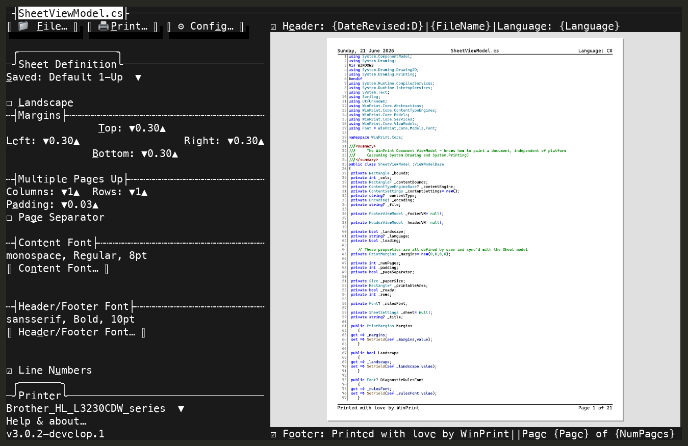
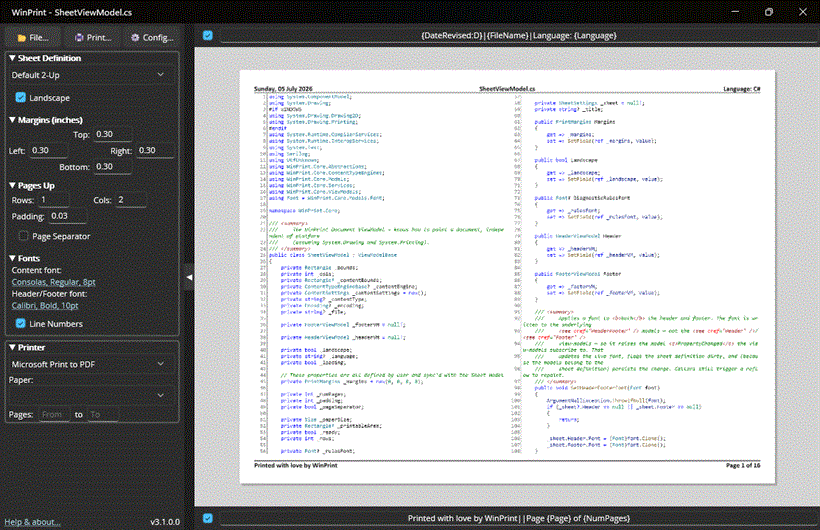
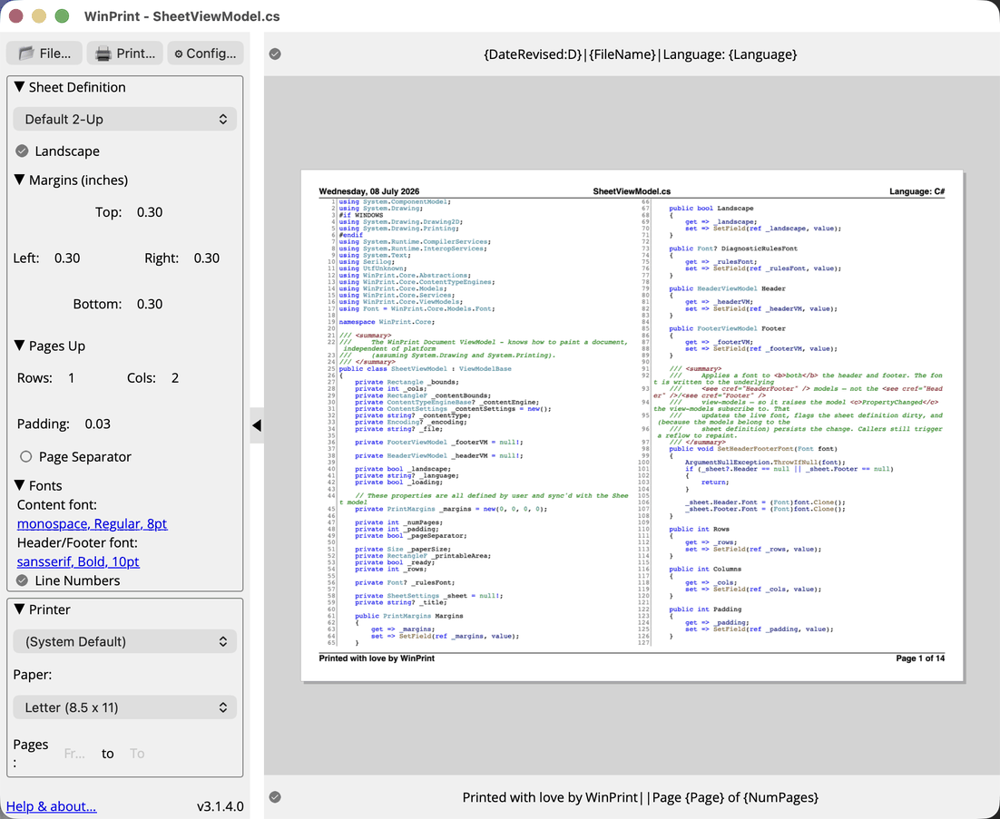
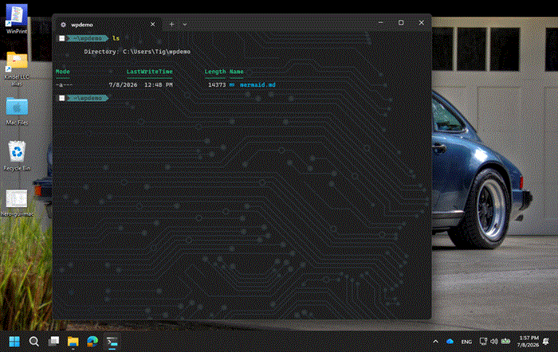

[](https://github.com/tig/winprint/releases)

# WinPrint

*A modern take on the classic source code printing app from [1988](about.md).*

Advanced source code, html, markdown, and text file printing for terminals (all platforms) and Windows/macOS GUIs. 

## Features

* Beautifully Prints:
  * Source code in hundreds of programming languages with syntax highlighting and line numbering.
  * HTML files.
  * Markdown files as formatted documents (headings, lists, blockquotes, code blocks, mermaid diagrams, and inline images).
  * ANSI-encoded text and colorized console captures (`.ans`/`.ansi`), decoding ANSI escape sequences to color.
* Saves trees printing "multiple-pages-up" on one piece of paper.
* Complete control over page formatting options, including headers and footers, margins, fonts, page orientation, etc.
* Headers and Footers support detailed file and print information macros with rich date/time formatting.
* Sheet Definitions make it easy to save settings for frequent print jobs.
* Accurate print preview in the GUI *and* TUI.
* `wp` provides a rich command line interface (CLI) on Windows, macOs, and Linux
  
### Terminal UI (`wp`)



*The `wp` terminal UI renders true print previews as sixel/kitty graphics, without leaving the terminal: page through a document, zoom in, pan with the mouse, switch sheet definitions, and open another file.*

### Windows GUI

  

### MacOS GUI

  

## How to turn Markdown into a PDF

One command, every platform. Markdown goes in; a formatted, paginated PDF comes out: headings, lists, tables, images, syntax-highlighted code, and ` ```mermaid ` fences rendered as real diagrams (via mermaid.ink by default, or fully in-process with the built-in renderer):

```powershell
wp print mermaid.md --pdf mermaid.pdf --sheet "Proportional 1-Up"
```

Prefer a real print queue? Point `--printer` at any print-to-PDF queue instead:

```powershell
# Windows — the built-in "Microsoft Print to PDF"
wp print mermaid.md --printer "Microsoft Print to PDF" --sheet "Proportional 1-Up"
```

```bash
# macOS — install a virtual PDF printer once (brew install --cask rwts-pdfwriter), add it in
# Printers & Scanners named "CUPS-PDF"; the PDF lands in /var/spool/pdfwriter/$USER/
wp print mermaid.md --printer "CUPS-PDF" --sheet "Proportional 1-Up"
```

```bash
# Linux — sudo apt install printer-driver-cups-pdf (queue name "PDF" on Debian/Ubuntu;
# confirm with lpstat -p; Fedora is often "Cups-PDF"). PDF lands in ~/PDF/
wp print mermaid.md --printer "PDF" --sheet "Proportional 1-Up"
```



*Shown: [`testfiles/mermaid.md`](testfiles/mermaid.md), one fence per mermaid diagram type, printed from the shell and opened in a viewer. The GIF is recorded on Windows; the macOS and Linux commands produce the same PDF. On Linux prefer `--pdf` when you only need a file — stock cups-pdf may re-encode through Ghostscript; mermaid rasters still survive.*

## Installation

### Windows

Install with [winget](https://learn.microsoft.com/windows/package-manager/winget/) — one command gives you both the GUI and the `wp` terminal UI:

```powershell
winget install Kindel.WinPrint
```

Or download the signed installer **`Kindel.WinPrint-win-x64-Setup.exe`** from the [latest release](https://github.com/tig/winprint/releases/latest) and run it. (On new releases SmartScreen may say it "isn't commonly downloaded"; that's a reputation check, not a signing problem; the publisher reads *Kindel, LLC*. See the [Installation Guide](https://tig.github.io/winprint/install.html#install-from-github-releases-download-the-installer).)

### macOS

```bash
brew tap kindel/winprint
brew install winprint          # WinPrint GUI app — also bundles the `wp` terminal UI
```

### Linux

```bash
brew install kindel/winprint/wp   # `wp` terminal UI (the GUI is Windows/macOS only)
```

See the [Installation Guide](https://tig.github.io/winprint/install.html) for detailed instructions, prerequisites, and upgrade/uninstall steps.

## Getting Started

Launch the TUI:

```bash
wp
```

Launch the GUI on Windows or macOS:

```bash
wp gui
```

You can also find **WinPrint** in the Start Menu (Windows) or via Spotlight (macOS).

## Documentation

* [Overview](https://tig.github.io/winprint/)
* [Installation Guide](https://tig.github.io/winprint/install.html)
* [User's Guide](https://tig.github.io/winprint/users-guide.html)
* [About](https://tig.github.io/winprint/about.html)
* [Support](https://tig.github.io/winprint/support.html)

## Contributing

See [CONTRIBUTING.md](CONTRIBUTING.md) for development setup, build instructions, and release process.
