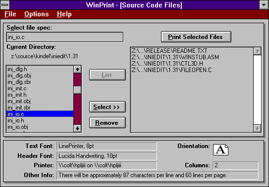

Ever since I started programming on an Apple ][+ in 1981, I've had a thing for printing. My earliest apps focused on printing and my first money-making endeavor was "Tapes", which printed casette tape '[J-cards](https://en.wikipedia.org/wiki/J-card)' for all the mix-tapes of great '80s music we made for the girls. Whenever I learned a new programming language or OS, the first app I'd write was **[Spit](https://github.com/tig/Tigger/blob/a2013af12fef6d9946adea7fe510f8c649766160/College/C_SRC/SPIT153.C)**, an app for printing my source code all pretty (it "spits" source code out of a printer). Over the years, I wrote Spit for AppleDOS (Apple BASIC), UCSD-Pascal, CP/M (Turbo Pascal), DOS (8086 assembly and C), VAX/VMS (Pascal and FORTRAN-77), and Mac (Pascal).

In 1988, as a college junior at the University of Arizona (Go Cats!), I decided Windows was going to win over OS/2 and I was going to work for Microsoft. I bought Charles Petzold's [Programming Windows]() and conned my dad into buying me a copy of the Windows 2.0 SDK (which was like $300 back then!). On my amazeballs ALR 386/33 PC I set about becoming a Windows programmer. The first useful) app I wrote was **WinSpit**. In a rare moment of adulting, I renamed the app [WinPrint and listed it on CompuServe](http://www.kindel.com/products/winprint/) as shareware ($25). For over ten years I received $25 checks the mail from folks all over the world. Even better, WinPrint demonstrated to Microsoft I could actually, really write code. So they hired me.

Several times in the early 1990s I started writing WinPrint 2.0. Each time I had the basics working and realized three things: 1) Nobody cares about printing source code, 3) I'd over-engineered things, and 2) the technology I choose was already dated (e.g. MFC). Two of those abandoned efforts can be found in my github archive [here (1992)](https://github.com/tig/Tigger/tree/master/Shareware/WINPRT2/WINPRINT) and [here (1994)](https://github.com/tig/Tigger/tree/master/Shareware/WINPRT2/WINPRT20).

Last year (2019) I got a wild-hair to write some code as a way of blowing off steam, and proving to myself I was still cool. It all started with Microsoft releasing the [Cascadia Code](https://devblogs.microsoft.com/commandline/cascadia-code/) font. I have a thing for fixed-pitch fonts. It's weird. Anyway, I installed the font in Terminal and VScode but just looking at stuff didn't satsify me. I needed to *use the font in anger*!. So I fixed some long-standing issues in [MCE Controller](https://tig.github.io/mcec/) (another app I wrote that nobody uses anymore).

This all led to me re-discovering my old WinPrint 2.0 source code. Reminiscing on how much time I wasted back then, and how effective it was as a procrastination tool, I just had to try again. So I did. And, just to be clear, here's what I did:

1) I wrote a *printing* app in 2019-2020. Nobody prints these days. *I* don't even print anymore. 
2) I over-engineered it. It has a full GUI with print preview. Headers and Footers with *Macros*. A full command-line interface. It can syntax-highlight over 200 different programming languages. It's cross-platfom. It's written in C# using the very latest .NET Core. It uses NodeJS and C++ under the covers. And more.
3) I used .NET and C#. Ok, this part I can defend (assuming you get past point #1 and #2): First, I know C# well and it is awesome. Second, no other modern language/app-framework can even SPELL "print". I tried both Electron and Flutter and both suck when it comes to printing.

So, there you are. I present to you winprint 2.0. I hope you enjoy it.

-tig ([@ckindel](twitter.com/ckindel) on twitter; see my [blog](https://ceklog.kindel.com))

## License (MIT)

Copyright (c) Kindel Systems, LLC

Permission is hereby granted, free of charge, to any person obtaining a copy of this software and associated documentation files (the "Software"), to deal in the Software without restriction, including without limitation the rights to use, copy, modify, merge, publish, distribute, sublicense, and/or sell copies of the Software, and to permit persons to whom the Software is furnished to do so, subject to the following conditions:

The above copyright notice and this permission notice shall be included in all copies or substantial portions of the Software.

THE SOFTWARE IS PROVIDED "AS IS", WITHOUT WARRANTY OF ANY KIND, EXPRESS OR IMPLIED, INCLUDING BUT NOT LIMITED TO THE WARRANTIES OF MERCHANTABILITY, FITNESS FOR A PARTICULAR PURPOSE AND NONINFRINGEMENT. IN NO EVENT SHALL THE AUTHORS OR COPYRIGHT HOLDERS BE LIABLE FOR ANY CLAIM, DAMAGES OR OTHER LIABILITY, WHETHER IN AN ACTION OF CONTRACT, TORT OR OTHERWISE, ARISING FROM, OUT OF OR IN CONNECTION WITH THE SOFTWARE OR THE USE OR OTHER DEALINGS IN THE SOFTWARE.