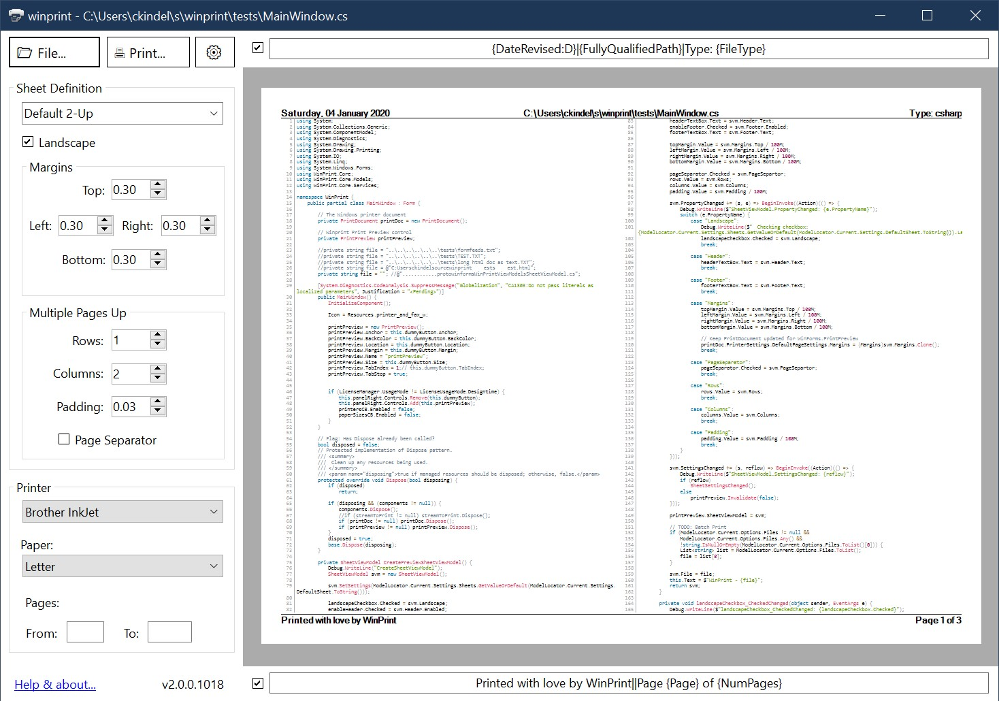
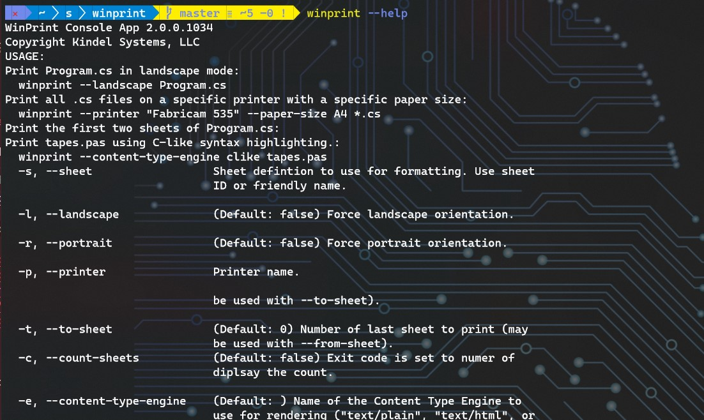

*A modern take on the the classic source code printing app from [1988](about.md).*

**winprint** is the perfect tool for printing source code, web pages, reports generated by legacy systems, documentation, or any text or HTML file. It works interactively or from the command line making it great for single users or whole enterprises.

## Features

* Print source code with syntax highlighting and line numbering for over 200 programming langauges and file formats.
* Print HTML files.
* Print "multiple-pages-up" on one piece of paper (saves trees!)
* Complete control over page formatting options, including headers and footers, margins, fonts, page orientation, etc...
* Headers and Footers support detailed file and print information macros with rich date/time formatting.
* Simple and elegant graphical user interface with accurate print preview.
* Complete command line interface. Allows winprint to be used from other applications or solutions.
* Sheet Definitions make it easy to save settings for frequent print jobs.
* Compressive logging.
* Cross platform. Even though it's named **win**print, it works on Windows, Linux (command line only), and (not yet tested) Mac OS.

See [User's Guide](users-guide.md) for more details.

## History

See [About](about.md) for the history prior to *winprint 2.0*.

* 20-Feb-2020 - 2.0.0.alpha-1034 - Minor bug fixes. Added version number to GUI. 
* 18-Feb-2020 - 2.0.0.alpha-1003 - First public build (alpha). I'm embarrased by a few bugs and performance issues that I want to fix before I declare beta; see [Issues](https://github.com/tig/winprint/issues).
