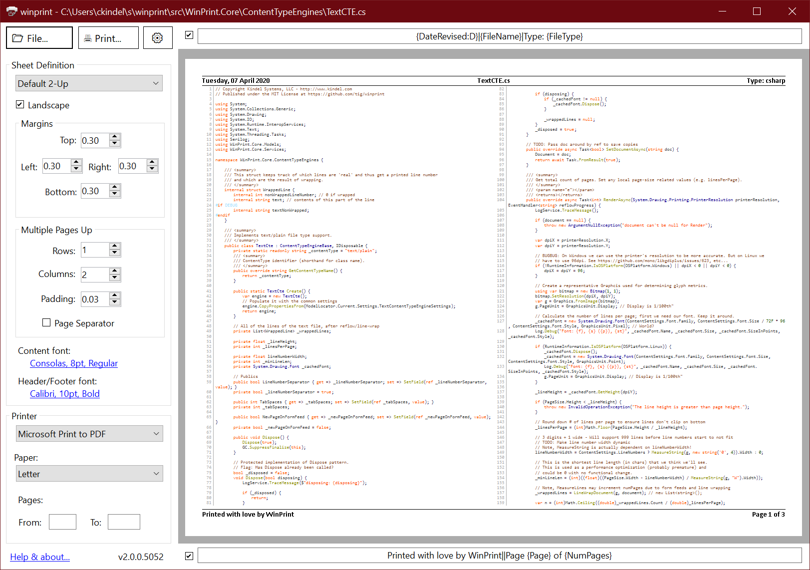

# winprint 2.0

*A modern take on the the classic source code printing app from [1988](about.md).*

Advanced source code and text file printing for PowerShell. The perfect tool for printing source code, web pages, reports generated by legacy systems, documentation, or any text or HTML file. It works interactively or from the command line making it great for single users or whole enterprises.




```powershell
winprint -verbose
VERBOSE: Out-WinPrint 2.0.3.0 - Copyright Kindel Systems, LLC - https://tig.github.io/winprint
```

```powershell
get-content Program.cs | wp
```

```powershell
ls .\* -include ('*.c', '*.h') | foreach { cat $_.FullName | out-winprint -p "LaserJet" -title $_.FullName -verbose}
```

## Features

* Print source code with syntax highlighting and line numbering for over 200 programming langauges and file formats.
* Print HTML files.
* Print "multiple-pages-up" on one piece of paper (saves trees!)
* Complete control over page formatting options, including headers and footers, margins, fonts, page orientation, etc...
* Headers and Footers support detailed file and print information macros with rich date/time formatting.
* Simple and elegant graphical user interface with accurate print preview.
* The most capaple PowerShell printing tool enabling printing from the command line.
  * Complete control of printing features with dozens of parameters, including *Intellicode* parameter completion (using `tab` key).
  * Allows **winprint** to be used from other applications or solutions. The **winpprint** PowerShell `out-winprint` CmdLet is a drop-in replacement for `out-printer`.
* Sheet Definitions make it easy to save settings for frequent print jobs.
* Comprehensive logging.
* Cross platform. Even though it's named **win**print, it works on Windows, Linux (command line only; some assembly required), and (not yet tested) Mac OS.

See [User's Guide](users-guide.md) for more details.

## History

See [About](about.md) for the history prior to *winprint 2.0*.

* 12-Apr-2020 - 2.0.0.6100 (Beta1) - Updated PowerShell cmdlet to run as a standalone app (e.g. wp foo.cs or out-winprint foo.cs.
  * Added ability to choose fonts from GUI
  * fixed print preview status bugs
  * Code refactoring; because why leave good enough alone?
* 07-Apr-2020 - 2.0.0.5000 (Beta2) - No more winprint.exe, just use `out-winprint foo.txt`, `winprint foo.txt`, or `wp foo.txt` from w/in Powershell. Also fixed powershell -verbose and -debug bugs.
* 04-Apr-2020 - 2.0.0.4000 (Beta1) - Finished PowerShell implementation. Auto-Update.
* 16-Mar-2020 - 2.0.0.3800 (Alpha) - PowerShell support.
* 09-Mar-2020 - 2.0.0.3002 (Alpha) - Updated installer, Telemetry, Minor bug fixes
* 03-Mar-2020 - 2.0.0.2022 (Alpha) - Fixed crashing bug at startup.
* 20-Feb-2020 - 2.0.0.1034 (Alpha) - Minor bug fixes. Added version number to GUI.
* 18-Feb-2020 - 2.0.0.1003 (Alpha) - First public build (alpha).

I'm embarrased by a few bugs and performance issues that I want to fix before I declare beta; see [Issues](https://github.com/tig/winprint/issues).
