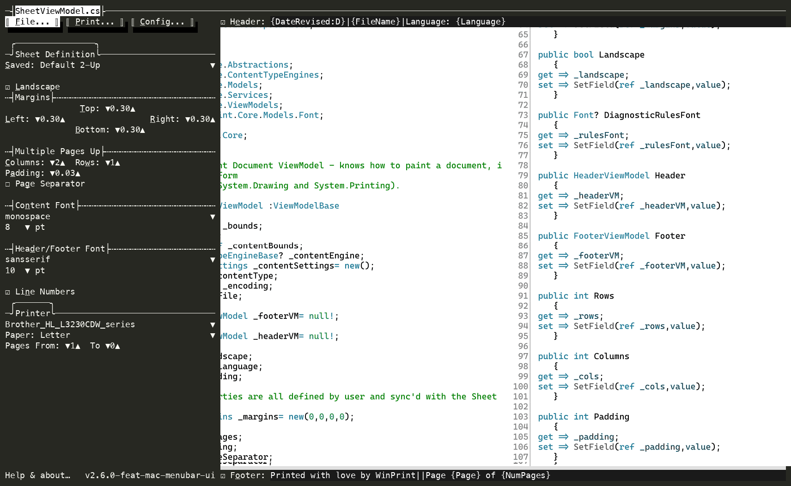

# WinPrint

*A modern take on the classic source code printing app from [1988](about.md).*

Advanced source code and text file printing for PowerShell, a scriptable CLI, and Windows. The perfect tool for printing source code, web pages, reports generated by legacy systems, documentation, or any text or HTML file. It works interactively or from the command line making it great for single users or whole enterprises.



## Quick Start

```bash
# Install (Windows)
winget install Kindel.WinPrint

# Print a file
wp program.cs

# Count sheets without printing (JSON output)
wp Program.cs --what-if --json

# Launch the GUI
wp gui
```

## Features

* Prints source code with syntax highlighting and line numbering using bundled TextMate grammars.
* Prints HTML files.
* Prints "multiple-pages-up" on one piece of paper (saves trees!)
* Complete control over page formatting options, including headers and footers, margins, fonts, page orientation, etc.
* Headers and Footers support detailed file and print information macros with rich date/time formatting.
* Simple and elegant graphical user interface with accurate print preview.
* `wp` provides a Terminal.Gui.Cli-based command line with JSON output and OpenCLI metadata for agents.
* The legacy PowerShell `Out-WinPrint` CmdLet remains available as `WinPrint.PowerShell.dll`, but is deprecated in favor of `wp`.
* Sheet Definitions make it easy to save settings for frequent print jobs.
* Comprehensive logging.
* Cross-platform: Windows, macOS, and Linux.

See [User's Guide](users-guide.md) for more details.

## History

See [About](about.md) for the full history of WinPrint.

For the latest changes, see the [GitHub Releases](https://github.com/tig/winprint/releases) page.
