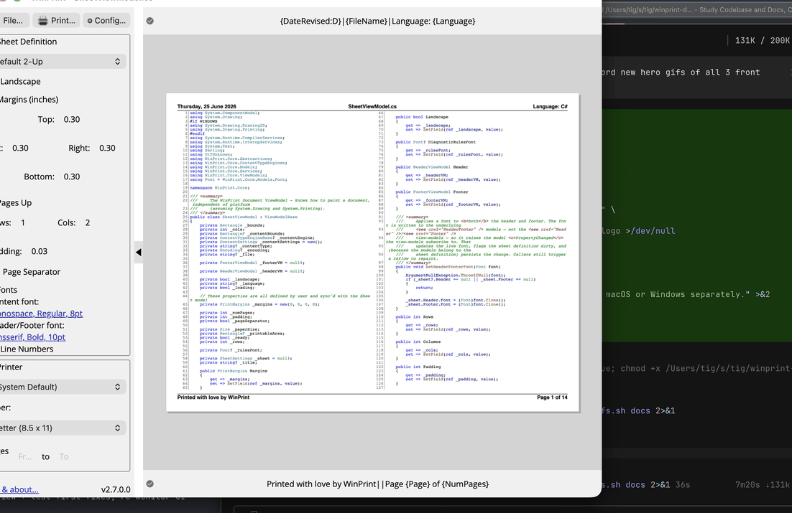

# WinPrint

*A modern take on the classic source code printing app from [1988](about.md).*

Advanced source code and text file printing for terminals (all platforms) and Windows/macOS GUIs. The perfect tool for printing source code, web pages, reports generated by legacy systems, documentation, or any text or HTML file.

### Terminal UI (`wp`)


### Headless print (`wp print`)


### Graphical UI (`wp gui`)

<p>
  
  
</p>

## Quick Start

```bash
# Install (Windows) — Scoop gives you the GUI + `wp` TUI in one command
scoop bucket add winprint https://github.com/kindel/scoop-winprint && scoop install winprint
# (or download Kindel.WinPrint-win-x64-Setup.exe from the latest GitHub release; winget coming soon)

# Install (Mac) — GUI cask, which also bundles the `wp` TUI
brew tap kindel/winprint && brew install winprint
# Want only the `wp` CLI (no GUI)? Install the formula instead — pick one, they collide:
#   brew install kindel/winprint/wp
# The .app is Apple Developer ID-signed and notarized, so Gatekeeper accepts it normally.

# Open a file in the TUI
wp program.cs

# Pass print preview options
wp Program.cs --printer "Microsoft Print to PDF" --sheet "Default 2-Up"

# Launch the GUI on Windows or macOS
wp gui

# The GUI can also be run from the Windows Start Menu or Spotlight on the Mac after installing
```

## Features

* Prints source code in hundreds of programming languages with syntax highlighting and line numbering.
* Prints HTML files.
* Prints "multiple-pages-up" on one piece of paper (saves trees!)
* Complete control over page formatting options, including headers and footers, margins, fonts, page orientation, etc.
* Headers and Footers support detailed file and print information macros with rich date/time formatting.
* Simple and elegant graphical user interface with accurate print preview on Windows and macOS.
* `wp` provides a terminal UI on Windows, macOS, and Linux.
* `wp gui` launches the GUI on Windows and macOS.
* Sheet Definitions make it easy to save settings for frequent print jobs.
* Comprehensive logging.
* Cross-platform TUI; Windows and macOS GUI

See [User's Guide](users-guide.md) for more details.

## History

See [About](about.md) for the full history of WinPrint.

For the latest changes, see the [GitHub Releases](https://github.com/tig/winprint/releases) page.
