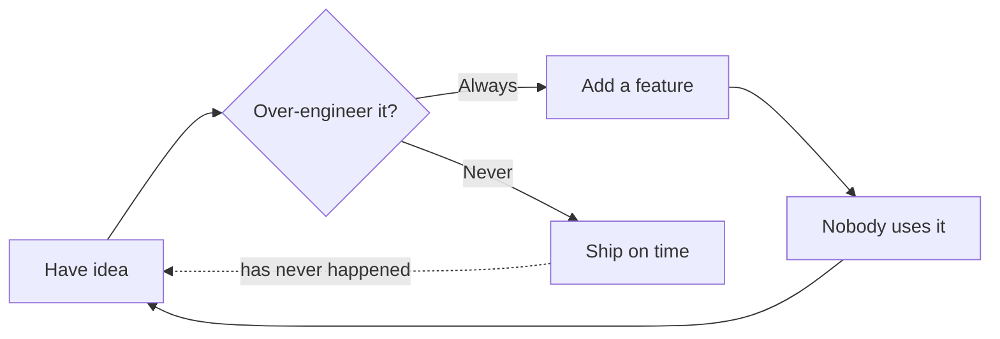
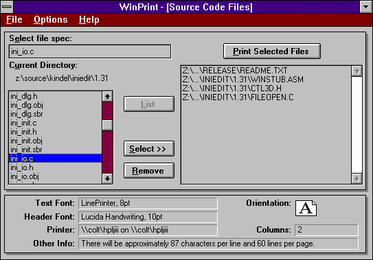

# WinPrint Markdown Demo

> A single file that exercises (nearly) every Markdown feature, so I can prove WinPrint
> renders the good stuff and gracefully shrugs at the stuff it does not support *yet*.
>
> Also: a monument to over-engineering a printing app in the year of our Lord 2020+. Nobody
> prints. *I* do not print. And yet, here we are. -tig

## Headings go all the way down

# H1 (the loud one)
## H2 (the workhorse)
### H3 (still respectable)
#### H4 (now we are just showing off)
##### H5 (who hurt you)
###### H6 (basically a footnote with delusions of grandeur)

## Text you can dress up

You can make text **bold** (for the parts nobody reads), *italic* (for the parts I felt
strongly about), ***both at once*** (for the parts I felt strongly about AND nobody reads),
`inline code` (for the parts that actually matter), and ~~strikethrough~~ (for the features I
swore I would ship in 1994). Also <sub>subscript</sub> (for chemical formulas and ego
deflation), <sup>superscript</sup> (for footnotes that have not yet been invented), and
<ins>underline</ins> (for the one emphasis style every style guide forbids).

Here is a footnote, because BobAtk, the inventor of COM and my mentor, taught me to use them effectively.[^1]

[^1]: I added footnote support at 2am. Nobody asked. This is the whole story of WinPrint.

## Mermaid Diagrams

The fenced block below prints as an actual diagram, rendered entirely in-process by default (or by the remote `mermaid.ink` service if you opt into the `service` backend); set `renderMermaidDiagrams` to `false` if you liked the code better. The promissory note, paid:



## Lists, ordered (IMO, all lists are ordered)

Not numbered, nested, mildly judgmental:

- Reasons to print source code
  - To read it on paper (romantic)
  - To spot the bug you could not see on screen (it works, annoyingly)
  - To put in a box so the paper yellows over time (I still have the OG WinPrint source in a box somewhere)
- Reasons not to
  - It is 2026
  - Trees
  - Printers suck.

Ordered, because sequence matters:

1. Write a printing app when printing matters (1989).
2. Decided to rewrite it when printing still sorta matters (1993), but didn't finish.
3. Really decide to rewrite it when printing no longer matters (2020).
4. Over-engineer 2.0.
   1. Add a GUI with live print preview.
   2. Add headers and footers. With **macros**.
   3. Add a print preview *in the terminal*, because obviously.
   4. Observe how only 14 people on the planet use it.
5. Over-engineer 3.0 to prove 3 things in 2026.
   1. Terminal.Gui kicks ass, espeically it's sixel/kitty graphics terminal support.
   2. AI coding is the future.
   3. People still don't print.

A task list of my remaining life goals:

- [x] Write WinPrint (1988)
- [x] Rewrite WinPrint (2020)
- [x] Rewrite it *again* as a TUI using AI (2026)
- [ ] Learn my lesson

## A table nobody asked for

| Feature | Hours Spent | Humans Who Use It | Return on Investment |
| --- | ---: | ---: | :---: |
| Syntax highlighting | 200 | 3 | Negative |
| Headers/footers with macros | 150 | 1 (me) | Deeply negative |
| Print preview IN THE TERMINAL | 400 | 0 | Transcendent |
| Cross-platform Mac + Windows GUI | 300 | 2 | Ask again in 1994 |
| This demo file | 1 | You, right now | Priceless |

## Code, or: proof I really did use .NET

Inline first: call `wp print README.md --what-if` and pretend you will read the output.

An honest C# "Hello, Printer", enterprise edition, because a `Console.WriteLine` would have
been too easy:

```csharp
// Prints one line. Took a factory, an interface, and my twenties.
public interface IGreetingStrategy { string Compose(string who); }

public sealed class OverEngineeredGreeting : IGreetingStrategy {
    public string Compose(string who) => $"Hello, {who}. Please consider not printing this.";
}

var strategy = new OverEngineeredGreeting();          // dependency injection sold separately
Console.WriteLine(strategy.Compose("Printer"));       // 200 lines omitted for your sanity
```

The same thing in PowerShell, which needed exactly one line and made me question everything:

```powershell
'Hello, Printer. Please consider not printing this.' | Write-Output
```

And the meta-move: a shell one-liner that prints the source code that prints source code.

```bash
wp print ./demo.md --sheet "Proportional 2-Up"   # yes, this file is printing itself. we are through the looking glass.
```

A little JSON, for the config file you will never open:

```json
{ "sheet": "Proportional 2-Up", "printer": "Microsoft Print to PDF", "regrets": [] }
```

## A picture worth 154 versions

Here is WinPrint 1.54, shareware, $25 by check, mailed from strangers who trusted the postal service more than the Internet:



## Blockquotes, where I argue with myself

> Nobody needs a printing app in 2026.
>
> > Sure, but does anyone *need* a hobby?
> >
> > > That is not a counter-argument, that is a coping mechanism.

## A slow-motion cry for help (version history)

Every version, and the excuse that shipped with it. Note that the "Users" column is measured
in whole humans, not thousands.

| Year | Version | Platform | What I Added | Users | Excuse |
| ---: | :--- | :--- | :--- | ---: | :--- |
| 1988 | WinSpit | Windows 2.0 | The whole idea | 1 | "It compiles!" |
| 1992 | WinPrint 1.x | Windows 3.1 | Shareware, $25 by mail | ~40 | "Strangers sent me checks!" |
| 1994 | WinPrint 2.0 (attempt 1) | Windows | MFC, then regret | 0 | "The tech was already dated" |
| 1998 | WinPrint 2.0 (attempt 2) | Windows | Less MFC, more regret | 0 | "I over-engineered it" |
| 2020 | WinPrint 2.0 (for real) | .NET | GUI, preview, macros | ~5 | "Cascadia Code made me do it" |
| 2021 | WinPrint 3.0 | Win + Mac + TUI | Print preview in a terminal | ~14 | "Imagine preview IN THE TERMINAL" |
| 2026 | WinPrint 3.1 | Everywhere | This demo file | You | "It renders Markdown now!" |

## More code, because why stop now

Python, which I do not write, doing something I would never do:

```python
def should_i_print(pages: int) -> str:
    # The only correct implementation.
    return "no" if pages >= 0 else "how did you get negative pages"

print(should_i_print(42))
```

A SQL query for a table that does not exist, in a database nobody deployed:

```sql
SELECT excuse, COUNT(*) AS times_used
FROM   winprint_release_notes
GROUP  BY excuse
ORDER  BY times_used DESC;   -- spoiler: "over-engineered it" wins
```

Some YAML, the language of people who were tired of JSON's commas:

```yaml
build:
  targets: [windows, macos, tui]
  features:
    - syntax-highlighting
    - headers-and-footers
    - macros            # you will regret asking about the macros
  ship_date: "soon"     # load-bearing quotation marks
```

A unified diff, so you can watch me delete a feature I spent a week on:

```diff
- <FancyFeature enabled="true" hours="40" users="0" />
+ <!-- removed. it was beautiful. it was pointless. -->
```

And a regular expression, presented without defense:

```text
/^(over)?engineer(ed|ing)?$/i   # matches my entire career
```

## Frequently unasked questions

**Q: Who is this for?**
A: People who print source code. Both of them. Hi, Dave.

**Q: Does it support Mermaid diagrams?**
A: Yes. See below. Rendered right here in the app; your diagrams are nobody's business.

**Q: Is printing dead?**
A: Yes. This app is a seance.

**Q: Why .NET and C#?**
A: Because I know C# well and it is awesome, and because no other modern language/framework
can even SPELL "print". I tried Electron and Flutter. Both suck at printing. This is the one
technical decision I will die on.

## A very long list of fixed-pitch fonts I have loved

Because a printing app is really just a font-appreciation society with extra steps:

1. Cascadia Code (the one that started this whole relapse)
2. Consolas (dependable, like a station wagon)
3. Fira Code (ligatures! `=>` becomes a little arrow and I feel things)
4. JetBrains Mono (tall, confident, slightly too cool for me)
5. IBM Plex Mono (business in the front, business in the back)
6. Source Code Pro (Adobe's polite contribution)
7. Courier New (the font of subpoenas and screenplays)
8. SF Mono (Apple, being Apple)
9. Hack (does what it says)
10. Comic Mono (do not @ me, it is real and it is glorious)

## Links, for the curious and the litigious

Inline: my [blog](https://blog.kindel.com) and the original [WinPrint shareware listing](http://www.kindel.com/products/winprint/).

Reference-style, because I like tidy paragraphs: WinPrint is built on [.NET][dotnet] and once
lived on [CompuServe][cis], a website you have to be a certain age to remember.

Autolink, no ceremony: <https://tig.github.io/mcec/>

Section link to a heading in this very file: [jump to Mermaid](#mermaid-diagrams).

[dotnet]: https://dotnet.microsoft.com/
[cis]: https://en.wikipedia.org/wiki/CompuServe

## Alerts (a.k.a. callouts, admonitions, or "please read this")

GitHub's five flavors of "I am serious this time." On paper they are just fancy blockquotes
until MarkdownCte grows a personality. Either way, here they are:

> [!NOTE]
> Useful information that users should know, even when skimming content. For example: this
> demo file is longer than your print job budget.

> [!TIP]
> Helpful advice for doing things better or more easily. Tip: `wp print testfiles/demo.md`
> is the whole product pitch.

> [!IMPORTANT]
> Key information users need to know to achieve their goal. Printing is optional. Reading
> this file is also optional. Living well is harder.

> [!WARNING]
> Urgent info that needs immediate user attention to avoid problems. Do not feed the
> macros after midnight.

> [!CAUTION]
> Advises about risks or negative outcomes of certain actions. Shipping a printing app in
> 2026 may cause friends to ask questions you cannot answer.

## Colors in backticks (GitHub issues/PRs only — we print them as code)

The background color is `#ffffff` for light mode and `#000000` for dark mode. Also
`#0969DA`, `rgb(9, 105, 218)`, and `hsl(212, 92%, 45%)` if your CTE ever learns to paint
little swatches. Until then: pretty hex strings.

## Mentions, issues, and emoji shortcodes

@github/support What do you think about these updates?

Issue-style refs that GitHub would autolink: #739, and a task that pretends to track work:

- [x] #739
- [ ] https://github.com/octo-org/octo-repo/issues/740
- [ ] Add delight to the experience when all tasks are complete :tada:

@octocat :+1: This PR looks great - it's ready to merge! :shipit:

## Escaping Markdown (when you mean the asterisk)

Let's rename \*our-new-project\* to \*our-old-project\*. Without the backslashes those would
be italics. With them, they are just characters that refused to grow up.

A task item that starts with a parenthesis has to escape too:

- [ ] \(Optional) Open a followup issue

## Hiding content with HTML comments

The next line is an HTML comment. If you can read a secret here in the rendered output,
something is wrong:

<!-- This content will not appear in the rendered Markdown. Also: the macros know what you did. -->

If the line above is blank in the printout, comments work. If you see the secret, file a bug
and then burn the page.

## Custom anchors and a hard line break

<a name="demo-custom-anchor"></a>
This paragraph has a custom HTML anchor (`demo-custom-anchor`) so section-link fans have
something to aim at: [link to custom anchor](#demo-custom-anchor).

Hard break after this line (backslash):\
should land on its own line in `.md` files. Soft wraps elsewhere are a lifestyle choice.

***

That is the tour. If any of it printed nicely, thank the fixed-pitch fonts. If it did not, that is a bug, and I will fix it at 2am for an audience of no one. Enjoy WinPrint 3.0!
