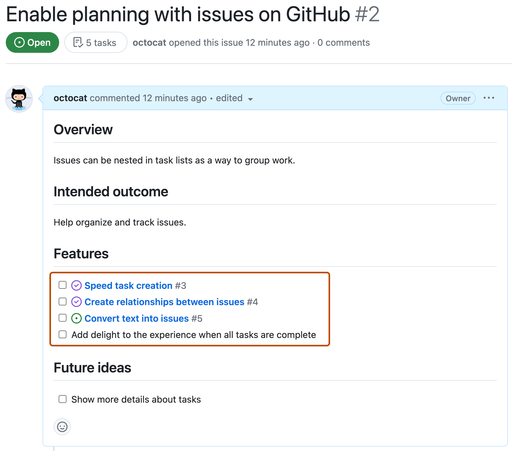
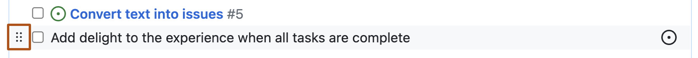
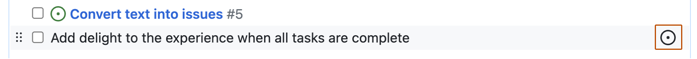
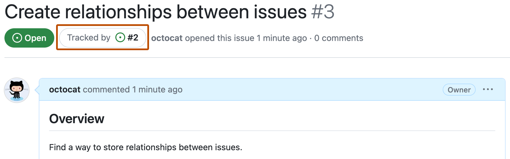

# About tasklists

You can use tasklists to break the work for an issue or pull request into smaller tasks, then track the full set of work to completion.

## About tasklists

> [!IMPORTANT]
> Tasklist blocks are retired. You can read more about this on the [GitHub Blog](https://github.blog/changelog/2025-02-18-github-issues-projects-february-18th-update/).
>
> You can use sub-issues as the replacement for tasklist blocks. Sub-issues provide a dedicated section within each issue, making it easier to track related work without relying on Markdown. For more information about sub-issues, see [Adding sub-issues](https://docs.github.com/en/issues/tracking-your-work-with-issues/using-issues/adding-sub-issues).

A tasklist is a set of tasks that each render on a separate line with a clickable checkbox. You can select or deselect the checkboxes to mark the tasks as complete or incomplete.

You can use Markdown to create a tasklist in any comment on GitHub. If you reference an issue, pull request, or discussion in a tasklist, the reference will unfurl to show the title and state.

## About issue tasklists

If you add a tasklist to the body of an issue, the list has added functionality.

* To help you track your team's work on an issue, the progress of an issue's tasklist appears in various places on GitHub, such as a repository's list of issues.
* If a task references another issue and someone closes that issue, the task's checkbox will automatically be marked as complete.
* If a task requires further tracking or discussion, you can convert the task to an issue by hovering over the task and clicking the issue icon in the upper-right corner of the task. To add more details before creating the issue, you can use keyboard shortcuts to open the new issue form. For more information, see [Keyboard shortcuts](https://docs.github.com/en/get-started/accessibility/keyboard-shortcuts#issues-and-pull-requests).
* Any issues referenced in the tasklist will specify that they are tracked in the referencing issue.



## Creating tasklists

To create a task list, preface list items with a hyphen and space followed by `[ ]`. To mark a task as complete, use `[x]`.

```markdown
- [x] #739
- [ ] https://github.com/octo-org/octo-repo/issues/740
- [ ] Add delight to the experience when all tasks are complete :tada:
```


Live tasklist:

- [x] #739
- [ ] https://github.com/octo-org/octo-repo/issues/740
- [ ] Add delight to the experience when all tasks are complete :tada:

> [!NOTE]
> You cannot create tasklist items within closed issues or issues with linked pull requests.

## Reordering tasks

You can reorder the items in a tasklist. First, click or hover to the left of a task's checkbox until a grid of six dots appears. Then, drag and drop the grid to move the task to a new location.

You can reorder tasks across different lists in the same comment, but you cannot reorder tasks across different comments.



## Converting tasks into issues

You can also convert tasks into issues. First, hover over one of the items in your tasklist and then click the convert-to-issue control.



## Navigating tracked issues

Any issues that are referenced in a tasklist specify that they are tracked by the issue that contains the tasklist. To navigate to the tracking issue from the tracked issue, click on the tracking issue number in the **Tracked by** section next to the issue status.


