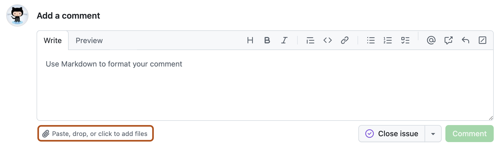
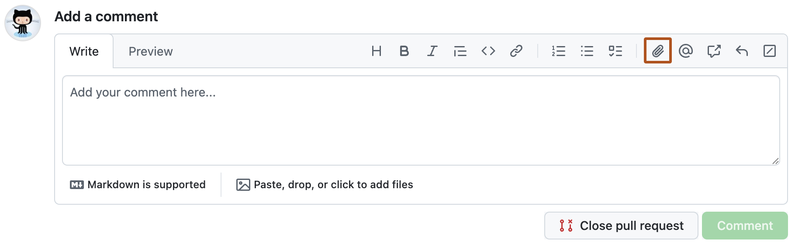

# Attaching files

You can convey information by attaching a variety of file types to issues and pull requests.
(Upload UI is GitHub-only; this fixture records the docs screenshots and a markdown image attach pattern.)

> **How to read these fixtures:** for each feature you get (a) a fenced **source** code block,
> (b) a **GitHub** screenshot of how GitHub renders it, and (c) the same Markdown **live** so
> WinPrint can render it. Compare (b) and (c) to see what works and what does not yet.


## Issue comment attach control

**Source:** (GitHub UI — not Markdown)

```text
Click the paperclip under an issue comment box, or drag-and-drop a file.
```

**GitHub:**



## Pull request comment attach control

**Source:** (GitHub UI — not Markdown)

```text
Click the paperclip in the pull request comment formatting bar.
```

**GitHub:**



## Markdown image attachment (local stand-in)

Uploaded images become Markdown image links. Local relative path stands in for an anonymized upload URL:

**Source:**

```markdown

```

**GitHub:** (attachment UI screenshots above)

**WinPrint (live):**


## Supported types (reference)

* Images: `.png`, `.gif`, `.jpg`, `.jpeg`, `.svg`
* Video: `.mp4`, `.mov`, `.webm`
* Documents: `.pdf`, Office, OpenDocument
* Code/text: `.cs`, `.js`, `.py`, `.md`, `.json`, …
