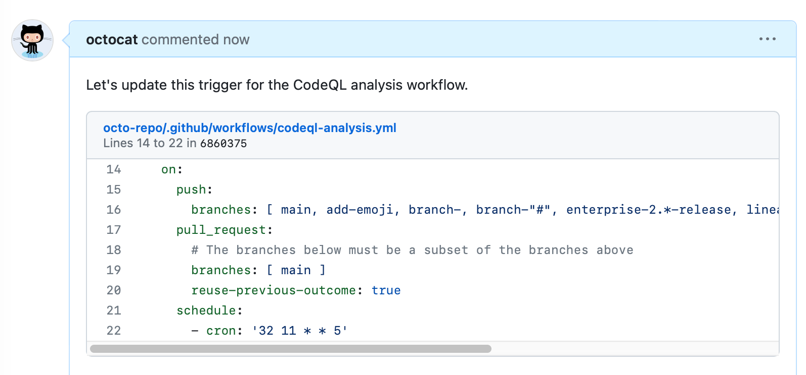
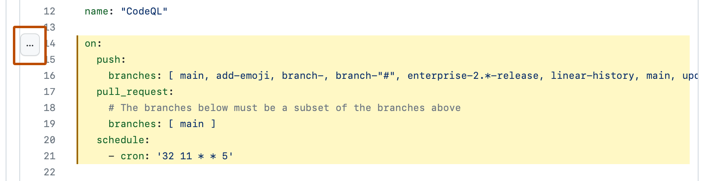

# Creating a permanent link to a code snippet

You can create a permanent link to a specific line or range of lines of code in a specific version of a file or pull request.
Permalink *embeds* only unfurl in issue/PR comments — not in `.md` files.

> **How to read these fixtures:** for each feature you get (a) a fenced **source** code block,
> (b) a **GitHub** screenshot of how GitHub renders it, and (c) the same Markdown **live** so
> WinPrint can render it. Compare (b) and (c) to see what works and what does not yet.


## Permalink in a comment (GitHub UI result)

**Source:** (paste a blob permalink into a comment)

```text
https://github.com/tig/winprint/blob/develop/src/WinPrint.Core/ContentTypeEngines/MarkdownCte.cs#L1-L20
```

**GitHub:**



**WinPrint (live):** (prints as a URL / link, not an embed)

https://github.com/tig/winprint/blob/develop/src/WinPrint.Core/ContentTypeEngines/MarkdownCte.cs#L1-L20

## Selecting lines for a permalink

**Source:** (GitHub UI — click line numbers, Copy permalink)

```text
1. Open a file on GitHub
2. Click a line number (Shift+click for a range)
3. Copy permalink from the line menu
4. Paste into a comment
```

**GitHub:**



## Plain Markdown line links

**Source:**

```markdown
[README line 14 (plain)](https://github.com/tig/winprint/blob/develop/README.md?plain=1#L14)
```

**WinPrint (live):**

[README line 14 (plain)](https://github.com/tig/winprint/blob/develop/README.md?plain=1#L14)
