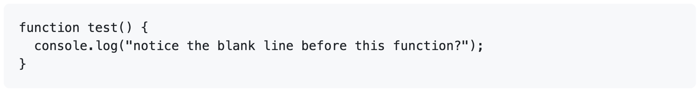
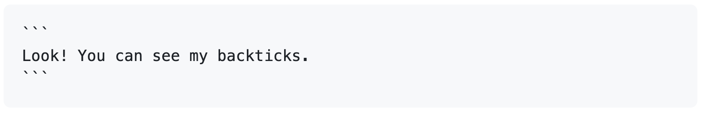
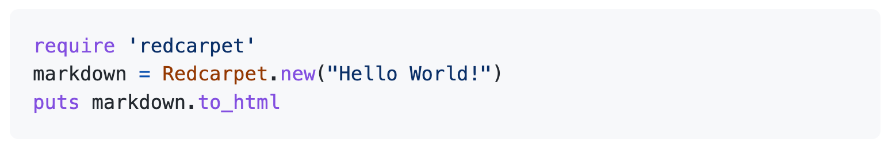

# Creating and highlighting code blocks

Share samples of code with fenced code blocks and enabling syntax highlighting.

## Fenced code blocks

You can create fenced code blocks by placing triple backticks ``` before and after the code block. We recommend placing a blank line before and after code blocks to make the raw formatting easier to read.

```
function test() {
  console.log("notice the blank line before this function?");
}
```



> [!TIP]
> To preserve your formatting within a list, make sure to indent non-fenced code blocks by eight spaces.

To display triple backticks in a fenced code block, wrap them inside quadruple backticks.

````
```
Look! You can see my backticks.
```
````



If you are frequently editing code snippets and tables, you may benefit from enabling a fixed-width font in all comment fields on GitHub. For more information, see [About writing and formatting on GitHub](https://docs.github.com/en/get-started/writing-on-github/getting-started-with-writing-and-formatting-on-github/about-writing-and-formatting-on-github#enabling-fixed-width-fonts-in-the-editor).

## Syntax highlighting

You can add an optional language identifier to enable syntax highlighting in your fenced code block.

Syntax highlighting changes the color and style of source code to make it easier to read.

For example, to syntax highlight Ruby code:

```ruby
require 'redcarpet'
markdown = Redcarpet.new("Hello World!")
puts markdown.to_html
```

This will display the code block with syntax highlighting:



> [!TIP]
> When you create a fenced code block that you also want to have syntax highlighting on a GitHub Pages site, use lower-case language identifiers. For more information, see [About GitHub Pages and Jekyll](https://docs.github.com/en/pages/setting-up-a-github-pages-site-with-jekyll/about-github-pages-and-jekyll#syntax-highlighting).

We use [Linguist](https://github.com/github-linguist/linguist) to perform language detection and to select [third-party grammars](https://github.com/github-linguist/linguist/blob/main/vendor/README.md) for syntax highlighting. You can find out which keywords are valid in [the languages YAML file](https://github.com/github-linguist/linguist/blob/main/lib/linguist/languages.yml).

## Creating diagrams

You can also use code blocks to create diagrams in Markdown. GitHub supports Mermaid, GeoJSON, TopoJSON, and ASCII STL syntax. For more information, see [Creating diagrams](creating-diagrams.md).

## Further reading

* [GitHub Flavored Markdown Spec](https://github.github.com/gfm/)
* [Basic writing and formatting syntax](github.md)
