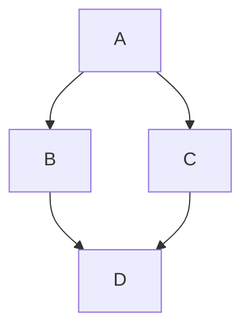

# Creating diagrams

Create diagrams to convey information through charts and graphs.

> **How to read these fixtures:** for each feature you get (a) a fenced **source** code block,
> (b) a **GitHub** screenshot of how GitHub renders it, and (c) the same Markdown **live** so
> WinPrint can render it. Compare (b) and (c) to see what works and what does not yet.


## Mermaid flow chart

**Source:**

````markdown

````

**GitHub:**


**WinPrint (live):**


## Mermaid version info

**Source:**

````markdown
```mermaid
  info
```
````

**WinPrint (live):**

```mermaid
  info
```

## GeoJSON map

**Source:**

````markdown
```geojson
{
  "type": "FeatureCollection",
  "features": [
    {
      "type": "Feature",
      "id": 1,
      "properties": { "ID": 0 },
      "geometry": {
        "type": "Polygon",
        "coordinates": [
          [
            [-90, 35],
            [-90, 30],
            [-85, 30],
            [-85, 35],
            [-90, 35]
          ]
        ]
      }
    }
  ]
}
```
````

**GitHub:**


**WinPrint (live):**

```geojson
{
  "type": "FeatureCollection",
  "features": [
    {
      "type": "Feature",
      "id": 1,
      "properties": { "ID": 0 },
      "geometry": {
        "type": "Polygon",
        "coordinates": [
          [
            [-90, 35],
            [-90, 30],
            [-85, 30],
            [-85, 35],
            [-90, 35]
          ]
        ]
      }
    }
  ]
}
```

## TopoJSON map

**Source:**

````markdown
```topojson
{
  "type": "Topology",
  "transform": {
    "scale": [0.0005000500050005, 0.00010001000100010001],
    "translate": [100, 0]
  },
  "objects": {
    "example": {
      "type": "GeometryCollection",
      "geometries": [
        {
          "type": "Point",
          "properties": {"prop0": "value0"},
          "coordinates": [4000, 5000]
        },
        {
          "type": "LineString",
          "properties": {"prop0": "value0", "prop1": 0},
          "arcs": [0]
        },
        {
          "type": "Polygon",
          "properties": {"prop0": "value0", "prop1": {"this": "that"}},
          "arcs": [[1]]
        }
      ]
    }
  },
  "arcs": [[[4000, 0], [1999, 9999], [2000, -9999], [2000, 9999]], [[0, 0], [0, 9999], [2000, 0], [0, -9999], [-2000, 0]]]
}
```
````

**GitHub:**


**WinPrint (live):**

```topojson
{
  "type": "Topology",
  "transform": {
    "scale": [0.0005000500050005, 0.00010001000100010001],
    "translate": [100, 0]
  },
  "objects": {
    "example": {
      "type": "GeometryCollection",
      "geometries": [
        {
          "type": "Point",
          "properties": {"prop0": "value0"},
          "coordinates": [4000, 5000]
        },
        {
          "type": "LineString",
          "properties": {"prop0": "value0", "prop1": 0},
          "arcs": [0]
        },
        {
          "type": "Polygon",
          "properties": {"prop0": "value0", "prop1": {"this": "that"}},
          "arcs": [[1]]
        }
      ]
    }
  },
  "arcs": [[[4000, 0], [1999, 9999], [2000, -9999], [2000, 9999]], [[0, 0], [0, 9999], [2000, 0], [0, -9999], [-2000, 0]]]
}
```

## ASCII STL 3D model

**Source:**

````markdown
```stl
solid cube_corner
  facet normal 0.0 -1.0 0.0
    outer loop
      vertex 0.0 0.0 0.0
      vertex 1.0 0.0 0.0
      vertex 0.0 0.0 1.0
    endloop
  endfacet
  facet normal 0.0 0.0 -1.0
    outer loop
      vertex 0.0 0.0 0.0
      vertex 0.0 1.0 0.0
      vertex 1.0 0.0 0.0
    endloop
  endfacet
  facet normal -1.0 0.0 0.0
    outer loop
      vertex 0.0 0.0 0.0
      vertex 0.0 0.0 1.0
      vertex 0.0 1.0 0.0
    endloop
  endfacet
  facet normal 0.577 0.577 0.577
    outer loop
      vertex 1.0 0.0 0.0
      vertex 0.0 1.0 0.0
      vertex 0.0 0.0 1.0
    endloop
  endfacet
endsolid
```
````

**GitHub:**


**WinPrint (live):**

```stl
solid cube_corner
  facet normal 0.0 -1.0 0.0
    outer loop
      vertex 0.0 0.0 0.0
      vertex 1.0 0.0 0.0
      vertex 0.0 0.0 1.0
    endloop
  endfacet
  facet normal 0.0 0.0 -1.0
    outer loop
      vertex 0.0 0.0 0.0
      vertex 0.0 1.0 0.0
      vertex 1.0 0.0 0.0
    endloop
  endfacet
  facet normal -1.0 0.0 0.0
    outer loop
      vertex 0.0 0.0 0.0
      vertex 0.0 0.0 1.0
      vertex 0.0 1.0 0.0
    endloop
  endfacet
  facet normal 0.577 0.577 0.577
    outer loop
      vertex 1.0 0.0 0.0
      vertex 0.0 1.0 0.0
      vertex 0.0 0.0 1.0
    endloop
  endfacet
endsolid
```
