# Basic writing and formatting syntax

Create sophisticated formatting for your prose and code on GitHub with simple syntax.
This fixture is a visual regression tour for MarkdownCte.

> **How to read these fixtures:** for each feature you get (a) a fenced **source** code block,
> (b) a **GitHub** screenshot of how GitHub renders it, and (c) the same Markdown **live** so
> WinPrint can render it. Compare (b) and (c) to see what works and what does not yet.


## Headings

**Source:**

```markdown
# A first-level heading
## A second-level heading
### A third-level heading
```

**GitHub:**

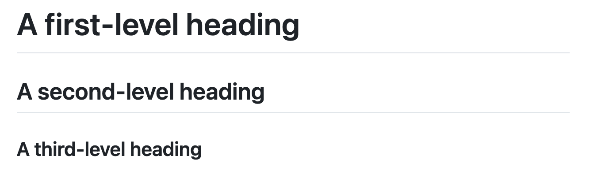

**WinPrint (live):**

# A first-level heading
## A second-level heading
### A third-level heading

## Table of contents UI (GitHub only)

**Source:** (GitHub file header UI)

```text
Outline menu in the file header when a document has two or more headings
```

**GitHub:**

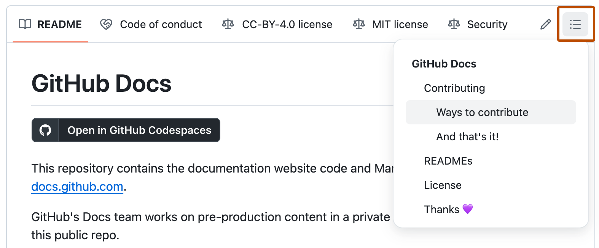

## Styling text

**Source:**

```markdown
**This is bold text**

_This text is italicized_

~~This was mistaken text~~

**This text is _extremely_ important**

***All this text is important***

This is a <sub>subscript</sub> text

This is a <sup>superscript</sup> text

This is an <ins>underlined</ins> text
```

**WinPrint (live):**

**This is bold text**

_This text is italicized_

~~This was mistaken text~~

**This text is _extremely_ important**

***All this text is important***

This is a <sub>subscript</sub> text

This is a <sup>superscript</sup> text

This is an <ins>underlined</ins> text

## Quoting text

**Source:**

```markdown
Text that is not a quote

> Text that is a quote
```

**GitHub:**

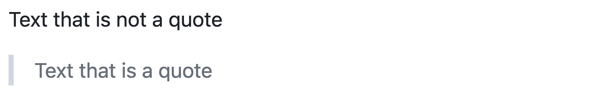

**WinPrint (live):**

Text that is not a quote

> Text that is a quote

## Inline code

**Source:**

```markdown
Use `git status` to list all new or modified files that haven't yet been committed.
```

**GitHub:**

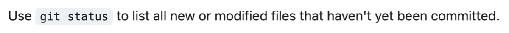

**WinPrint (live):**

Use `git status` to list all new or modified files that haven't yet been committed.

## Fenced code block

**Source:**

````markdown
Some basic Git commands are:
```
git status
git add
git commit
```
````

**GitHub:**

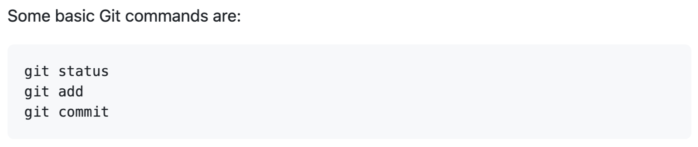

**WinPrint (live):**

Some basic Git commands are:

```
git status
git add
git commit
```

## Supported color models

**Source:**

```markdown
The background color is `#ffffff` for light mode and `#000000` for dark mode.

Also: `#0969DA`, `rgb(9, 105, 218)`, `hsl(212, 92%, 45%)`
```

**GitHub:**

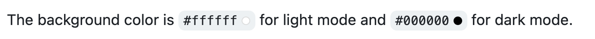


**WinPrint (live):**

The background color is `#ffffff` for light mode and `#000000` for dark mode.

Also: `#0969DA`, `rgb(9, 105, 218)`, `hsl(212, 92%, 45%)`

## Links

**Source:**

```markdown
This site was built using [GitHub Pages](https://pages.github.com/).
```

**GitHub:**

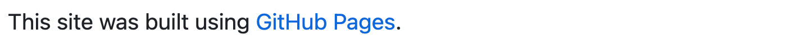

**WinPrint (live):**

This site was built using [GitHub Pages](https://pages.github.com/).

## Section links

**Source:** (GitHub UI for heading anchors)

```text
Hover a heading and click the link icon to copy the section URL
```

**GitHub:**

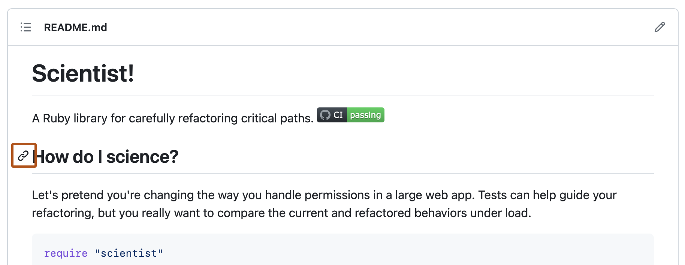

**WinPrint (live):**

See [Headings](#headings) and [Links](#links) in this file.

## Images

**Source:**

```markdown
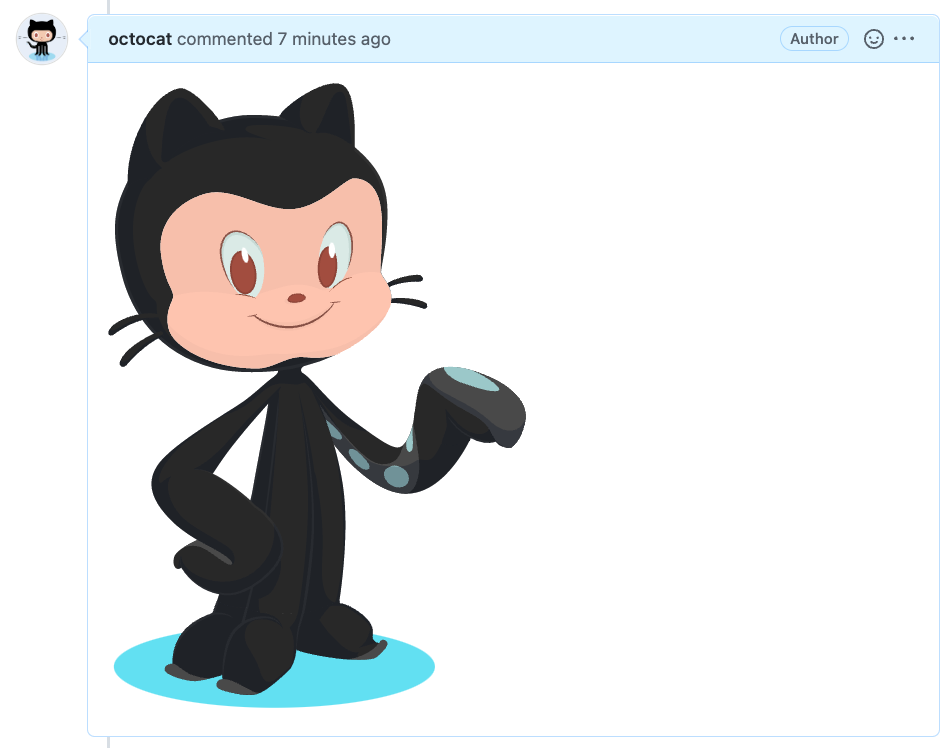
```

**GitHub:**


**WinPrint (live):**


## Unordered list

**Source:**

```markdown
- George Washington
* John Adams
+ Thomas Jefferson
```

**GitHub:**

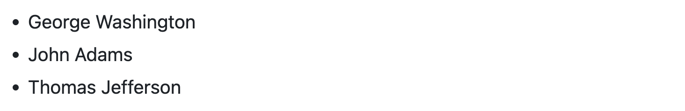

**WinPrint (live):**

- George Washington
* John Adams
+ Thomas Jefferson

## Ordered list

**Source:**

```markdown
1. James Madison
2. James Monroe
3. John Quincy Adams
```

**GitHub:**

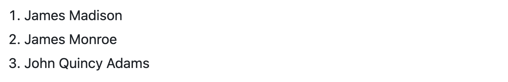

**WinPrint (live):**

1. James Madison
2. James Monroe
3. John Quincy Adams

## Nested list

**Source:**

```markdown
1. First list item
   - First nested list item
     - Second nested list item
```

**GitHub:**

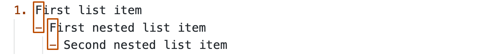

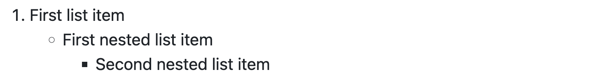

**WinPrint (live):**

1. First list item
   - First nested list item
     - Second nested list item

## Nested under large numbers

**Source:**

```markdown
100. First list item
     - First nested list item
```

**GitHub:**

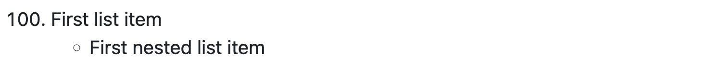

**WinPrint (live):**

100. First list item
     - First nested list item

**Source (two levels):**

```markdown
100. First list item
     - First nested list item
       - Second nested list item
```

**GitHub:**

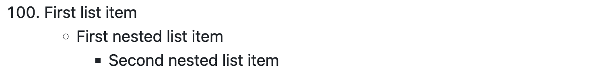

**WinPrint (live):**

100. First list item
     - First nested list item
       - Second nested list item

## Task lists

**Source:**

```markdown
- [x] #739
- [ ] https://github.com/octo-org/octo-repo/issues/740
- [ ] Add delight to the experience when all tasks are complete :tada:
```

**GitHub:**

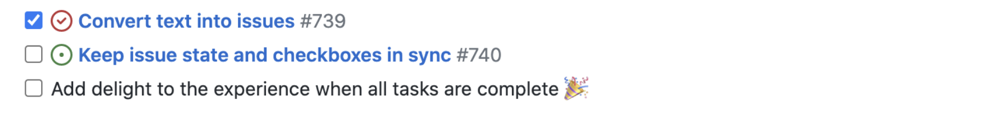

**WinPrint (live):**

- [x] #739
- [ ] https://github.com/octo-org/octo-repo/issues/740
- [ ] Add delight to the experience when all tasks are complete :tada:

## Mentions

**Source:**

```markdown
@github/support What do you think about these updates?
```

**GitHub:**

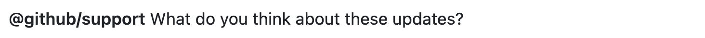

**WinPrint (live):**

@github/support What do you think about these updates?

## Emoji shortcodes

**Source:**

```markdown
@octocat :+1: This PR looks great - it's ready to merge! :shipit:
```

**GitHub:**


**WinPrint (live):**

@octocat :+1: This PR looks great - it's ready to merge! :shipit:

## Footnotes

**Source:**

```markdown
Here is a simple footnote[^1].

A footnote can also have multiple lines[^2].

[^1]: My reference.
[^2]: To add line breaks within a footnote, add 2 spaces to the end of a line.  
This is a second line.
```

**GitHub:**

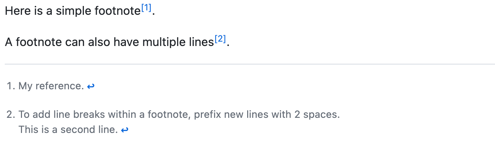

**WinPrint (live):**

Here is a simple footnote[^1].

A footnote can also have multiple lines[^2].

[^1]: My reference.
[^2]: To add line breaks within a footnote, add 2 spaces to the end of a line.  
This is a second line.

## Alerts

**Source:**

```markdown
> [!NOTE]
> Useful information that users should know, even when skimming content.

> [!TIP]
> Helpful advice for doing things better or more easily.

> [!IMPORTANT]
> Key information users need to know to achieve their goal.

> [!WARNING]
> Urgent info that needs immediate user attention to avoid problems.

> [!CAUTION]
> Advises about risks or negative outcomes of certain actions.
```

**GitHub:**

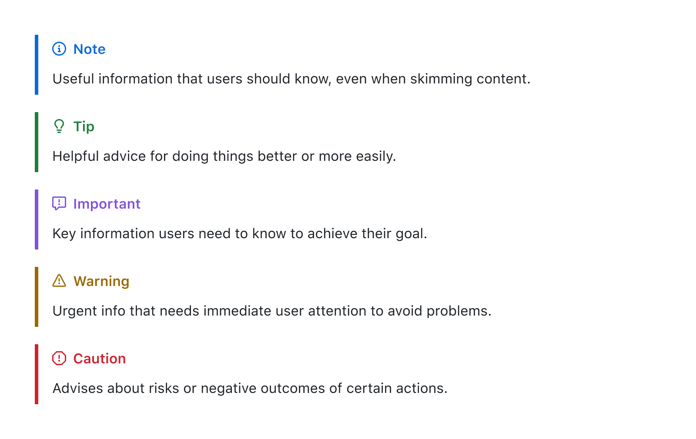

**WinPrint (live):**

> [!NOTE]
> Useful information that users should know, even when skimming content.

> [!TIP]
> Helpful advice for doing things better or more easily.

> [!IMPORTANT]
> Key information users need to know to achieve their goal.

> [!WARNING]
> Urgent info that needs immediate user attention to avoid problems.

> [!CAUTION]
> Advises about risks or negative outcomes of certain actions.

## Escaping Markdown

**Source:**

```markdown
Let's rename \*our-new-project\* to \*our-old-project\*.
```

**GitHub:**


**WinPrint (live):**

Let's rename \*our-new-project\* to \*our-old-project\*.

## Viewing source (GitHub UI)

**Source:** (GitHub file viewer)

```text
Click Code at the top of a Markdown file to disable rendering
```

**GitHub:**

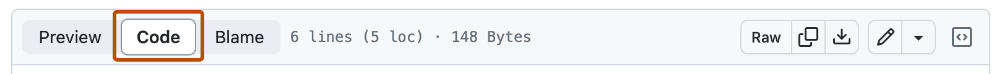

## Further reading

* [Working with advanced formatting](working-with-advanced-formatting.md)
* [GitHub Flavored Markdown Spec](https://github.github.com/gfm/)
