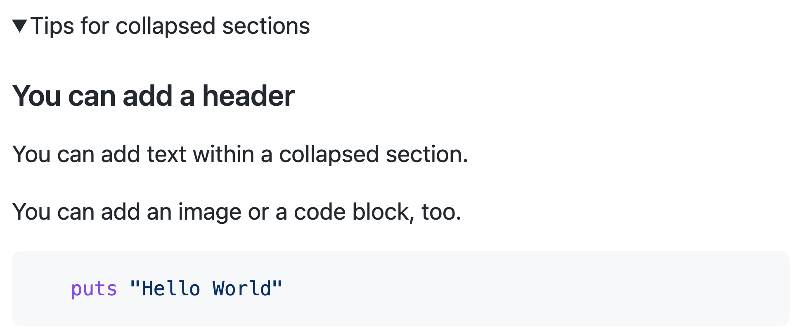

# Organizing information with collapsed sections

You can streamline Markdown with a collapsed section using the `<details>` tag.

> **How to read these fixtures:** for each feature you get (a) a fenced **source** code block,
> (b) a **GitHub** screenshot of how GitHub renders it, and (c) the same Markdown **live** so
> WinPrint can render it. Compare (b) and (c) to see what works and what does not yet.


## Collapsed section

**Source:**

````markdown
<details>

<summary>Tips for collapsed sections</summary>

### You can add a header

You can add text within a collapsed section.

You can add an image or a code block, too.

```ruby
   puts "Hello World"
```

</details>
````

**GitHub (collapsed):**


**GitHub (expanded):**



**WinPrint (live):**

<details>

<summary>Tips for collapsed sections</summary>

### You can add a header

You can add text within a collapsed section.

You can add an image or a code block, too.

```ruby
   puts "Hello World"
```

</details>

## Open by default

**Source:**

```html
<details open>
<summary>This section starts open</summary>

Printed documents cannot toggle open/closed. Engines may always expand details, or show only the summary.
</details>
```

**WinPrint (live):**

<details open>
<summary>This section starts open</summary>

Printed documents cannot toggle open/closed. Engines may always expand details, or show only the summary.
</details>
