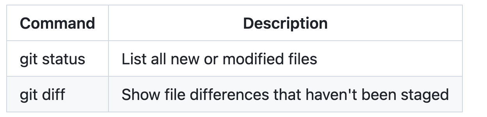
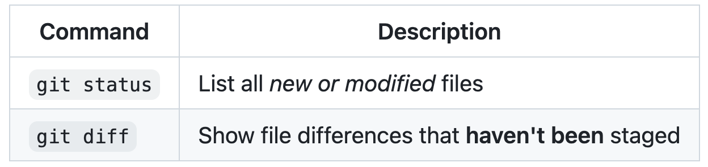
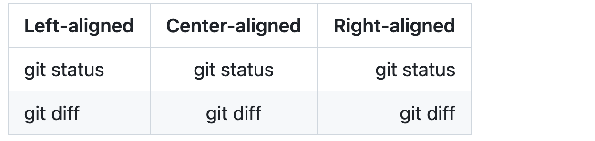

# Organizing information with tables

You can build tables to organize information in comments, issues, pull requests, and wikis.

## Creating a table

You can create tables with pipes `|` and hyphens `-`. Hyphens are used to create each column's header, while pipes separate each column. You must include a blank line before your table in order for it to correctly render.

```markdown

| First Header  | Second Header |
| ------------- | ------------- |
| Content Cell  | Content Cell  |
| Content Cell  | Content Cell  |
```


The pipes on either end of the table are optional.

Cells can vary in width and do not need to be perfectly aligned within columns. There must be at least three hyphens in each column of the header row.

```markdown
| Command | Description |
| --- | --- |
| git status | List all new or modified files |
| git diff | Show file differences that haven't been staged |
```



If you are frequently editing code snippets and tables, you may benefit from enabling a fixed-width font in all comment fields on GitHub. For more information, see [About writing and formatting on GitHub](https://docs.github.com/en/get-started/writing-on-github/getting-started-with-writing-and-formatting-on-github/about-writing-and-formatting-on-github#enabling-fixed-width-fonts-in-the-editor).

## Formatting content within your table

You can use [formatting](https://docs.github.com/en/get-started/writing-on-github/getting-started-with-writing-and-formatting-on-github/basic-writing-and-formatting-syntax) such as links, inline code blocks, and text styling within your table:

```markdown
| Command | Description |
| --- | --- |
| `git status` | List all *new or modified* files |
| `git diff` | Show file differences that **haven't been** staged |
```



You can align text to the left, right, or center of a column by including colons `:` to the left, right, or on both sides of the hyphens within the header row.

```markdown
| Left-aligned | Center-aligned | Right-aligned |
| :---         |     :---:      |          ---: |
| git status   | git status     | git status    |
| git diff     | git diff       | git diff      |
```



To include a pipe `|` as content within your cell, use a `\` before the pipe:

```markdown
| Name     | Character |
| ---      | ---       |
| Backtick | `         |
| Pipe     | \|        |
```


## Further reading

* [GitHub Flavored Markdown Spec](https://github.github.com/gfm/)
* [Basic writing and formatting syntax](github.md)
