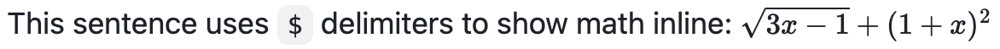
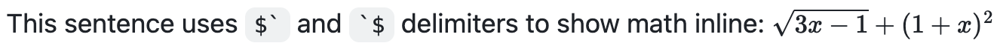
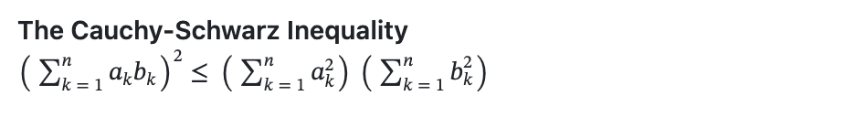

# Writing mathematical expressions

Use Markdown to display mathematical expressions on GitHub (MathJax).

> **How to read these fixtures:** for each feature you get (a) a fenced **source** code block,
> (b) a **GitHub** screenshot of how GitHub renders it, and (c) the same Markdown **live** so
> WinPrint can render it. Compare (b) and (c) to see what works and what does not yet.


## Inline math (`$…$`)

**Source:**

```markdown
This sentence uses `$` delimiters to show math inline: $\sqrt{3x-1}+(1+x)^2$
```

**GitHub:**



**WinPrint (live):**

This sentence uses `$` delimiters to show math inline: $\sqrt{3x-1}+(1+x)^2$

## Inline math (backtick form)

**Source:**

```markdown
This sentence uses $\` and \`$ delimiters to show math inline: $`\sqrt{3x-1}+(1+x)^2`$
```

**GitHub:**



**WinPrint (live):**

This sentence uses $` and `$ delimiters to show math inline: $`\sqrt{3x-1}+(1+x)^2`$

## Block math (`$$…$$`)

**Source:**

```markdown
**The Cauchy-Schwarz Inequality**\
$$\left( \sum_{k=1}^n a_k b_k \right)^2 \leq \left( \sum_{k=1}^n a_k^2 \right) \left( \sum_{k=1}^n b_k^2 \right)$$
```

**GitHub:**



**WinPrint (live):**

**The Cauchy-Schwarz Inequality**\
$$\left( \sum_{k=1}^n a_k b_k \right)^2 \leq \left( \sum_{k=1}^n a_k^2 \right) \left( \sum_{k=1}^n b_k^2 \right)$$

## Block math (```math fence)

**Source:**

````markdown
**The Cauchy-Schwarz Inequality**

```math
\left( \sum_{k=1}^n a_k b_k \right)^2 \leq \left( \sum_{k=1}^n a_k^2 \right) \left( \sum_{k=1}^n b_k^2 \right)
```
````

**WinPrint (live):**

**The Cauchy-Schwarz Inequality**

```math
\left( \sum_{k=1}^n a_k b_k \right)^2 \leq \left( \sum_{k=1}^n a_k^2 \right) \left( \sum_{k=1}^n b_k^2 \right)
```

## Dollar sign inside math

**Source:**

```markdown
This expression uses `\$` to display a dollar sign: $`\sqrt{\$4}`$
```

**GitHub:**


**WinPrint (live):**

This expression uses `\$` to display a dollar sign: $`\sqrt{\$4}`$

## Dollar sign outside math

**Source:**

```markdown
To split <span>$</span>100 in half, we calculate $100/2$
```

**GitHub:**


**WinPrint (live):**

To split <span>$</span>100 in half, we calculate $100/2$
