# Mermaid, the grand tour and stress test

`demo.md` shows one diagram and calls it a day. This file is the **grand tour + stress test** for Mermaid rendering in WinPrint:

*   Complex examples of **every diagram type the built-in renderer (Mermaider 0.9.0 + Svg.Skia) supports** — which, as of 0.9.0, is every Mermaid diagram type except ZenUML, plus the Mermaider-only TreeView.
*   Additional complexities, subgraphs, notes, styling, and edge cases for supported types.
*   Syntax variants that older Mermaider releases rejected (e.g. `pie title ...` on the header line) — kept as regression stress cases now that they parse.
*   One deliberately **unsupported type** (ZenUML) that falls back to a plain code block.

**Purpose**: stress the parsing/rendering pipeline, serve as a living benchmark (image count + visual output changes with Mermaider upgrades), and prove that the fallback chain *always* works cleanly. A fence that should render as an image produces exactly one `DrawnImage`; everything else produces source text in the output.

The default backend is the private in-process `builtin` renderer (Mermaider): no data leaves the machine. To use the remote `mermaid.ink` service instead (full Mermaid.js fidelity, sends diagram source):

```json
"markdownContentTypeEngineSettings": {
    "mermaidBackend": "service"
}
```

(You can also set `renderMermaidDiagrams: false` to disable Mermaid rendering entirely and always show source code blocks.)

If a section below prints as source instead of a picture under the default backend, that is the documented fallback doing its job (or a deliberate stress case). Know which before filing a bug.

## Supported by builtin (Mermaider)

### Flowchart, with subgraphs and decisions

The classic. Direction, shapes, edge labels, two subgraphs, and a decision node.

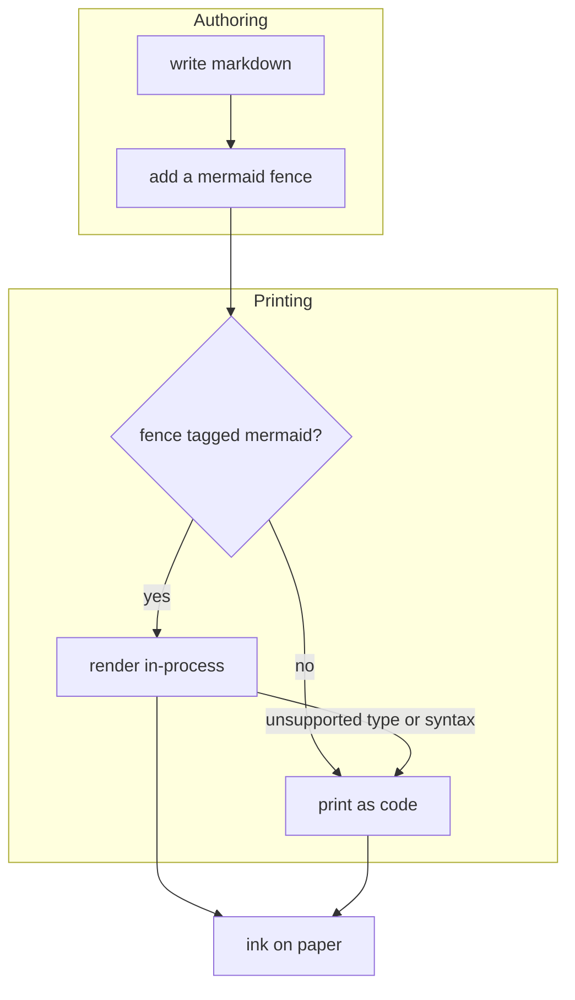
```mermaid
flowchart TB
    subgraph authoring[Authoring]
        MD[write markdown] --> FENCE[add a mermaid fence]
    end
    subgraph printing[Printing]
        PARSE{fence tagged mermaid?}
        PARSE -->|yes| RENDER[render in-process]
        PARSE -->|no| CODE[print as code]
        RENDER -->|unsupported type or syntax| CODE
    end
    FENCE --> PARSE
    RENDER --> PAGE[ink on paper]
    CODE --> PAGE
```

### Sequence, with alt, opt, and a note

Lifelines, solid and dashed arrows, alt + opt blocks, and a note.

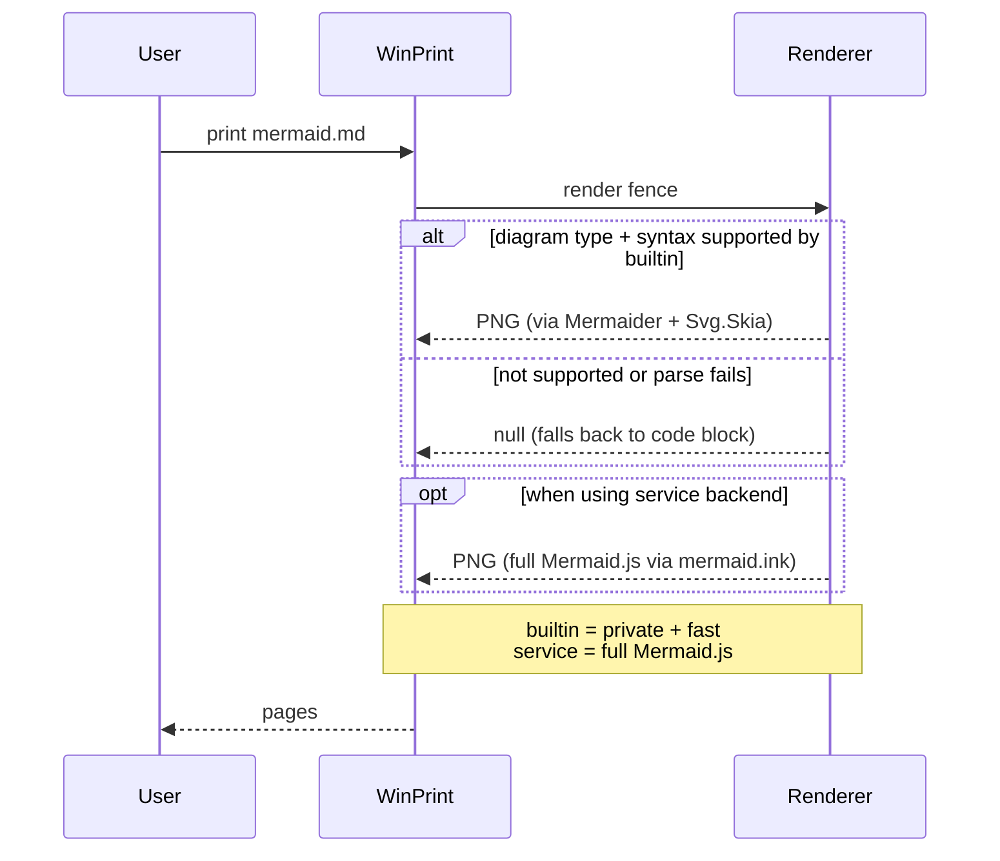
```mermaid
sequenceDiagram
    participant U as User
    participant W as WinPrint
    participant R as Renderer
    U->>W: print mermaid.md
    W->>R: render fence
    alt diagram type + syntax supported by builtin
        R-->>W: PNG (via Mermaider + Svg.Skia)
    else not supported or parse fails
        R-->>W: null (falls back to code block)
    end
    opt when using service backend
        R-->>W: PNG (full Mermaid.js via mermaid.ink)
    end
    Note over W,R: builtin = private + fast<br/>service = full Mermaid.js
    W-->>U: pages
```

### State

Every printer I have ever owned:

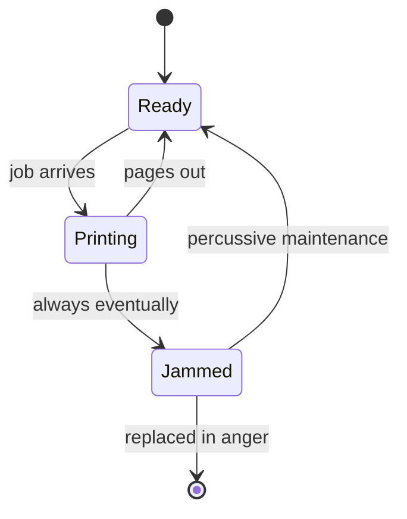
```mermaid
stateDiagram-v2
    [*] --> Ready
    Ready --> Printing: job arrives
    Printing --> Ready: pages out
    Printing --> Jammed: always eventually
    Jammed --> Ready: percussive maintenance
    Jammed --> [*]: replaced in anger
```

### Class

The inheritance hierarchy nobody asked to see printed, printed:

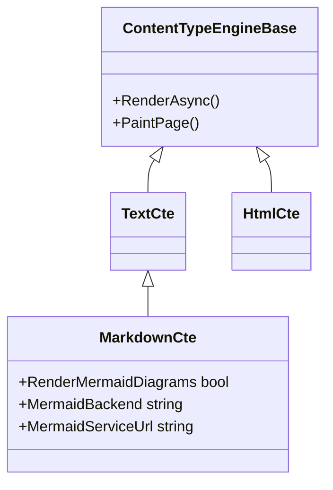
```mermaid
classDiagram
    ContentTypeEngineBase <|-- TextCte
    TextCte <|-- MarkdownCte
    ContentTypeEngineBase <|-- HtmlCte
    ContentTypeEngineBase : +RenderAsync()
    ContentTypeEngineBase : +PaintPage()
    MarkdownCte : +RenderMermaidDiagrams bool
    MarkdownCte : +MermaidBackend string
    MarkdownCte : +MermaidServiceUrl string
```

### Entity-relationship

A database for a printing app, which is to say, over-engineering:

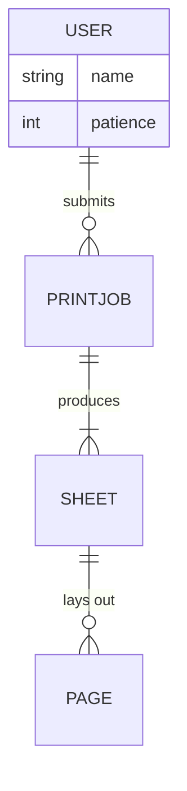
```mermaid
erDiagram
    USER ||--o{ PRINTJOB : submits
    PRINTJOB ||--|{ SHEET : produces
    SHEET ||--o{ PAGE : "lays out"
    USER {
        string name
        int patience
    }
```

### Git graph

Every release, ever:


```mermaid
gitGraph
    commit
    commit
    branch fix-the-fix
    commit
    checkout main
    merge fix-the-fix
    commit tag: "v3.x.x"
```

### Mindmap

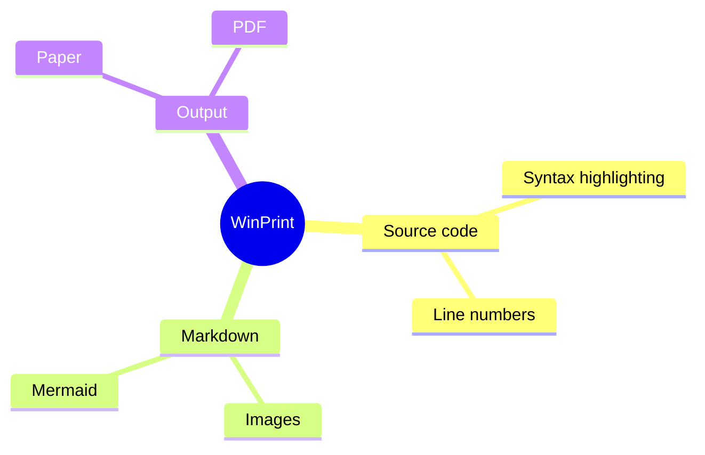
```mermaid
mindmap
  root((WinPrint))
    Source code
      Syntax highlighting
      Line numbers
    Markdown
      Images
      Mermaid
    Output
      Paper
      PDF
```

### Timeline

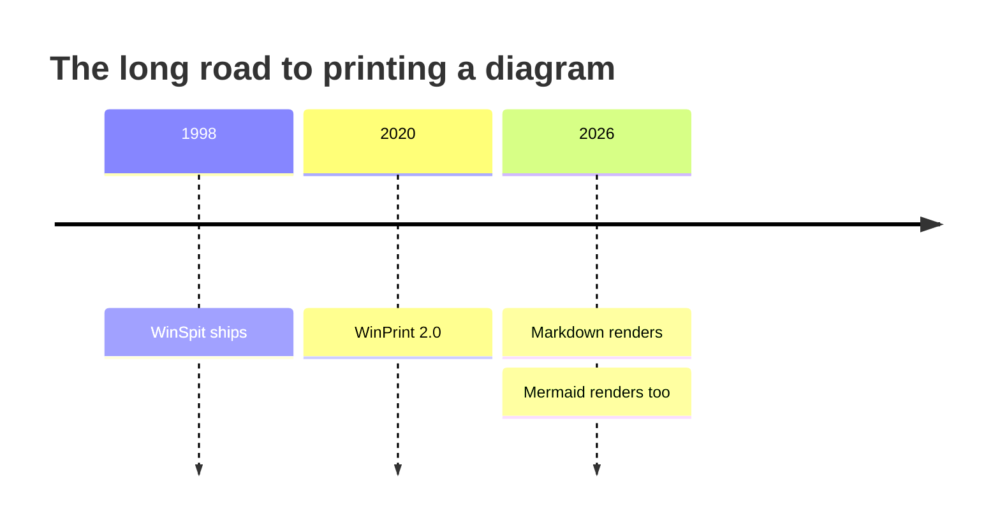
```mermaid
timeline
    title The long road to printing a diagram
    1998 : WinSpit ships
    2020 : WinPrint 2.0
    2026 : Markdown renders
         : Mermaid renders too
```

### Quadrant

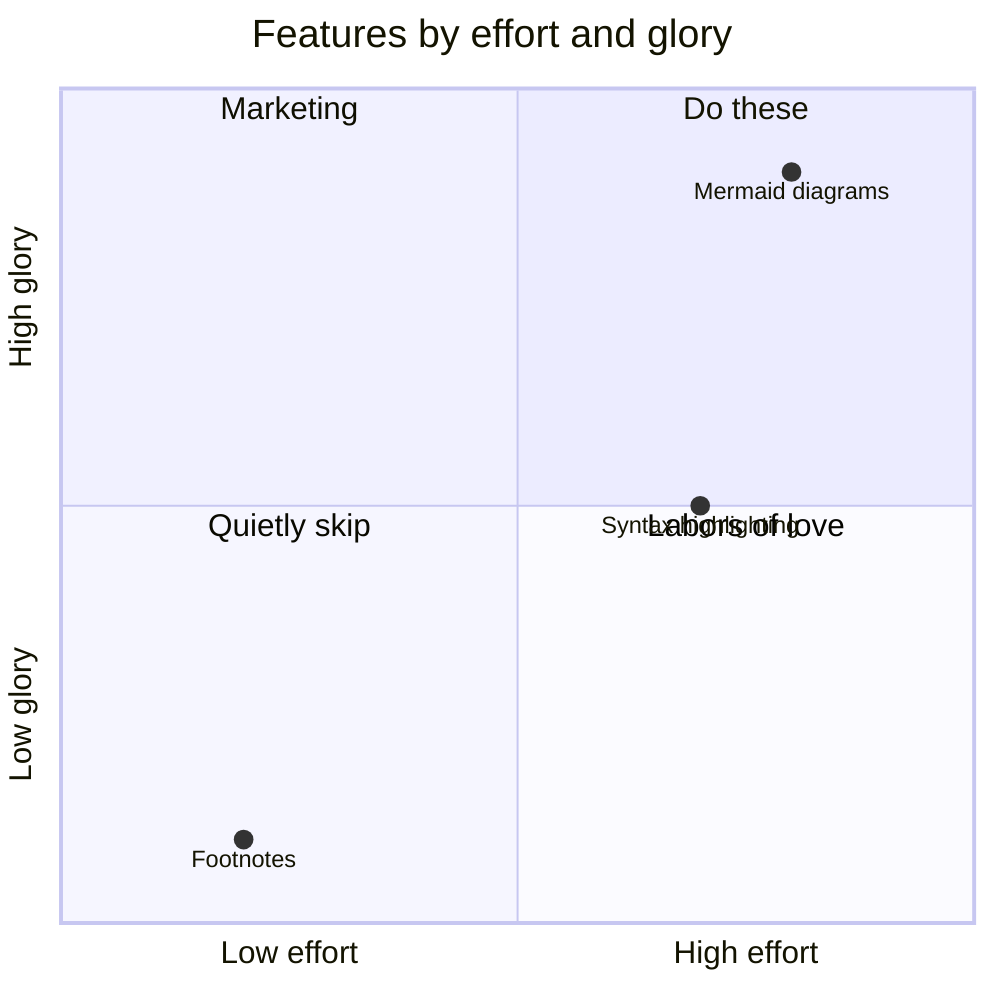
```mermaid
quadrantChart
    title Features by effort and glory
    x-axis Low effort --> High effort
    y-axis Low glory --> High glory
    quadrant-1 Do these
    quadrant-2 Marketing
    quadrant-3 Quietly skip
    quadrant-4 Labors of love
    Syntax highlighting: [0.7, 0.5]
    Mermaid diagrams: [0.8, 0.9]
    Footnotes: [0.2, 0.1]
```

### Pie (header on its own line)

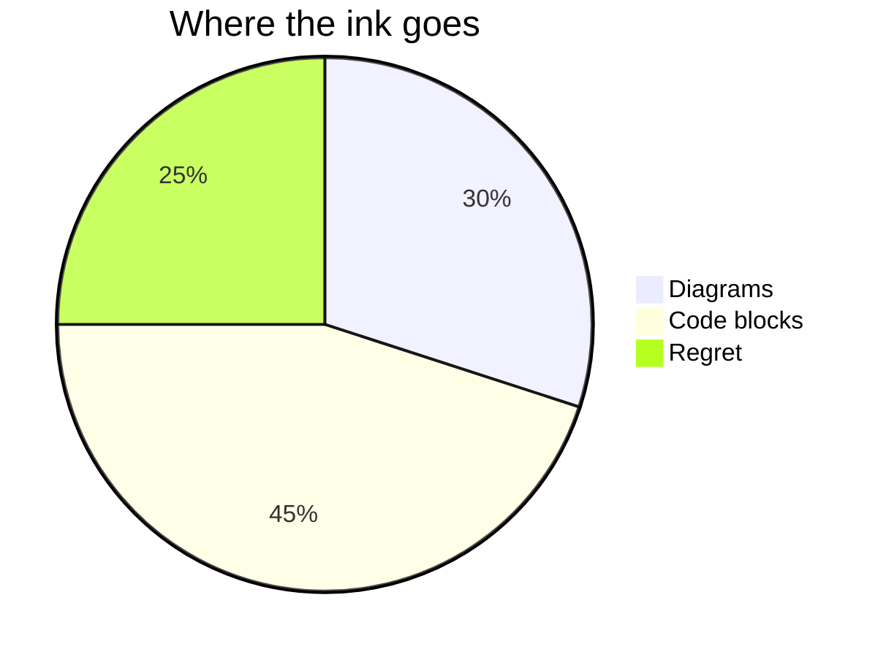
```mermaid
pie
    title Where the ink goes
    "Diagrams" : 30
    "Code blocks" : 45
    "Regret" : 25
```

### Radar (beta)

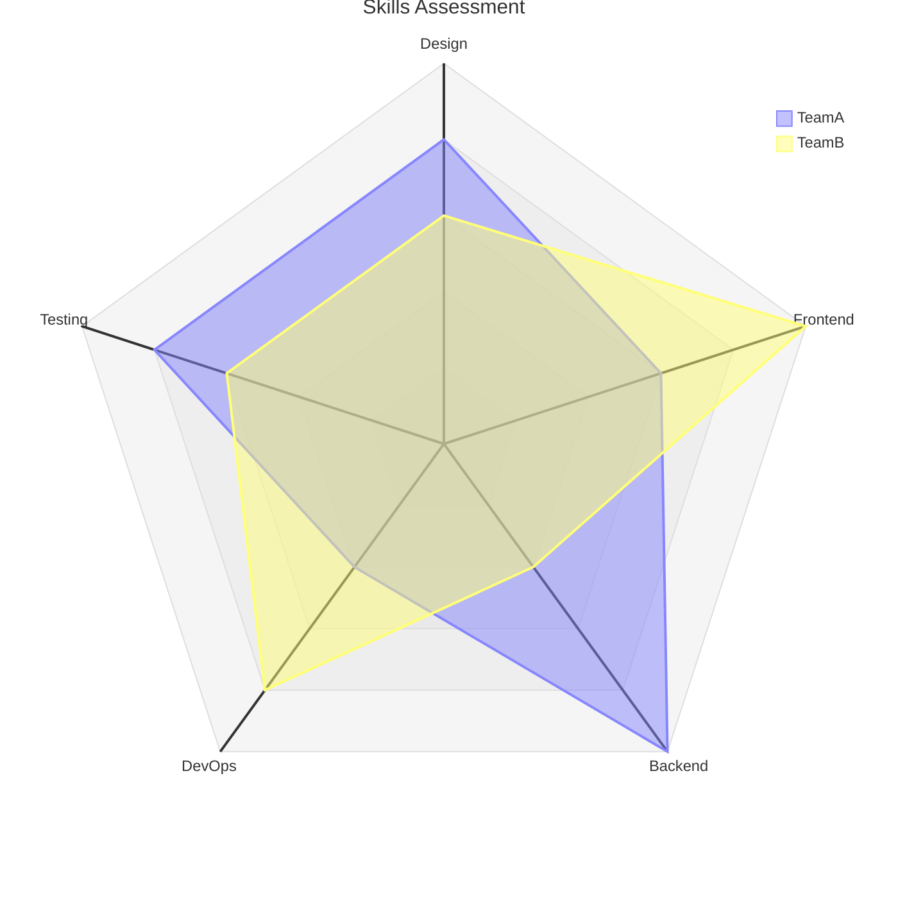
```mermaid
radar-beta
    title Skills Assessment
    axis Design, Frontend, Backend, DevOps, Testing
    curve TeamA{4, 3, 5, 2, 4}
    curve TeamB{3, 5, 2, 4, 3}
    max 5
    graticule polygon
```

### Treemap (beta)

```mermaid
treemap-beta
    "Core Rendering": 40
    "Mermaid Support": 15
    "TUI": 20
    "Maui GUI": 15
    "Docs + Tests": 10
```

### Venn (beta)

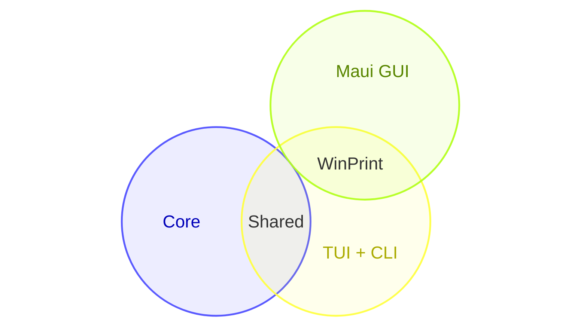
```mermaid
venn-beta
    set Core["Core"]
    set TUI["TUI + CLI"]
    set GUI["Maui GUI"]
    union Core,TUI["Shared"]
    union TUI,GUI["WinPrint"]
```

### Gantt

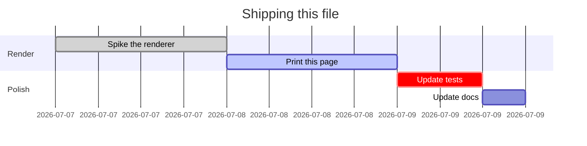
```mermaid
gantt
    title Shipping this file
    dateFormat  YYYY-MM-DD
    section Render
    Spike the renderer :done, a1, 2026-07-07, 1d
    Print this page    :active, a2, after a1, 1d
    section Polish
    Update tests       :crit, after a2, 12h
    Update docs        : 6h
```

### XY Chart

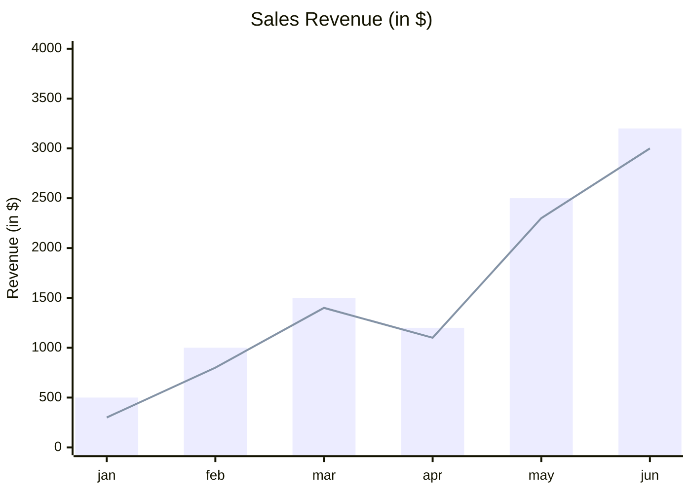
```mermaid
xychart-beta
    title "Sales Revenue (in $)"
    x-axis [jan, feb, mar, apr, may, jun]
    y-axis "Revenue (in $)" 0 --> 4000
    bar [500, 1000, 1500, 1200, 2500, 3200]
    line [300, 800, 1400, 1100, 2300, 3000]
```

### Sankey

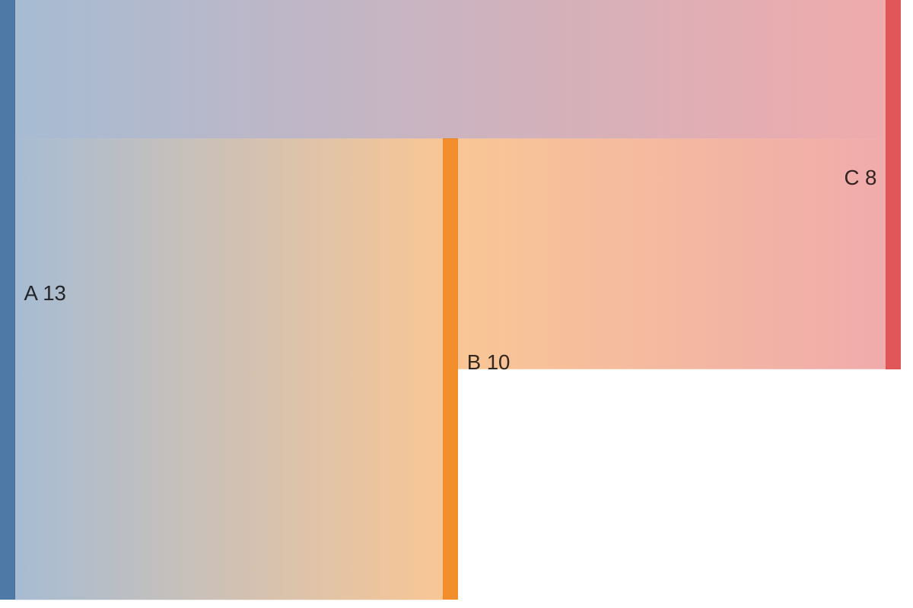
```mermaid
sankey-beta
    A, B, 10
    B, C, 5
    A, C, 3
```

### User Journey

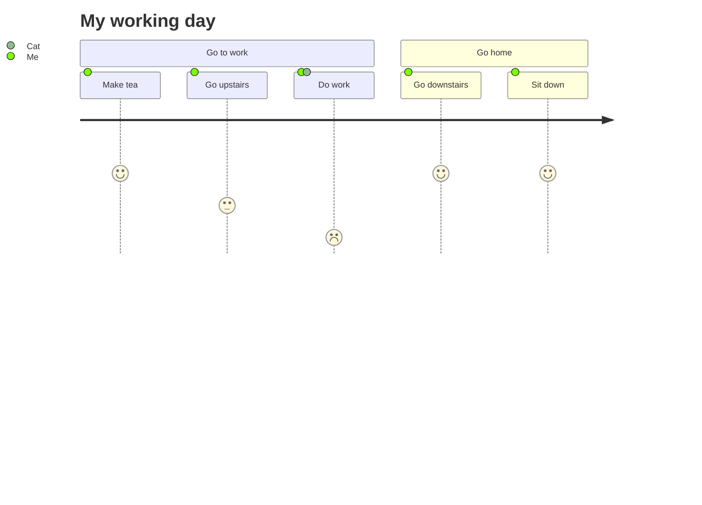
```mermaid
journey
    title My working day
    section Go to work
      Make tea: 5: Me
      Go upstairs: 3: Me
      Do work: 1: Me, Cat
    section Go home
      Go downstairs: 5: Me
      Sit down: 5: Me
```

### Requirement Diagram

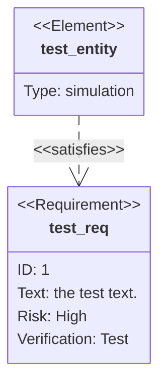
```mermaid
requirementDiagram

requirement test_req {
id: 1
text: the test text.
risk: high
verifymethod: test
}

element test_entity {
type: simulation
}

test_entity - satisfies -> test_req
```

### C4 Context (simple)

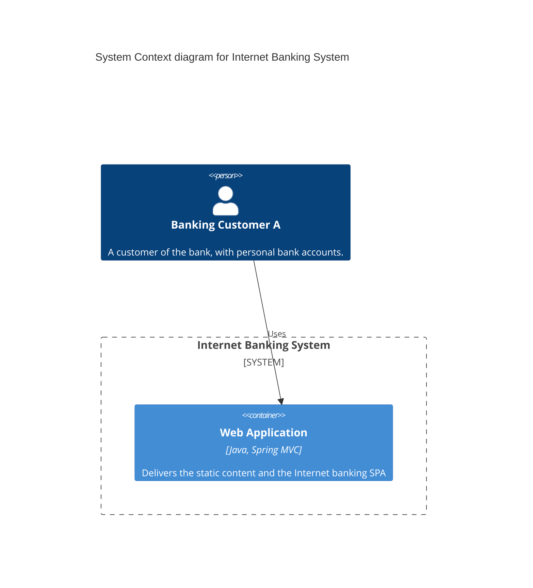
```mermaid
C4Context
    title System Context diagram for Internet Banking System

    Person(customerA, "Banking Customer A", "A customer of the bank, with personal bank accounts.")
    System_Boundary(banking_system, "Internet Banking System") {
        Container(web_app, "Web Application", "Java, Spring MVC", "Delivers the static content and the Internet banking SPA")
    }

    Rel(customerA, web_app, "Uses")
```

### Kanban

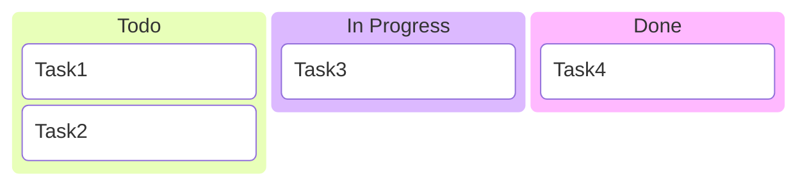
```mermaid
kanban
  Todo
    Task1
    Task2
  In Progress
    Task3
  Done
    Task4
```

### Block Diagram

```mermaid
block-beta
columns 3
  A["A"] B["B"] C["C"]
  D["D"] E["E"] F["F"]
```

### Packet

```mermaid
packet-beta
0-15: "Header"
16-31: "Source"
32-47: "Destination"
```

### Architecture (beta)

```mermaid
architecture-beta
    group api(cloud)[API]

    service db(cloud)[Database]
    service disk(cloud)[Disk]

    api:B --> db:T
    api:B --> disk:T
```

### TreeView (beta, Mermaider extension)

Not a Mermaid.js type (the service backend falls back for this one); Mermaider renders
file-system-style trees from indentation or box-drawing characters.

```mermaid
treeView-beta
    winprint/
        src/
            WinPrint.Core/
            WinPrint.TUI/
        testfiles/
            mermaid.md
        README.md
```

## Syntax stress cases (former builtin limitations, now regression guards)

Mermaider releases before 0.9.0 rejected these very common header forms even though official
mermaid.js accepts them; they used to prove the fallback path. As of 0.9.0 they parse and render.
They stay here so a regression in title-on-header-line parsing shows up as a changed image count.

### Pie with title on the same line as the keyword (very common form)

```mermaid
pie title Where the ink goes (compact header form)
    "Diagrams" : 30
    "Code blocks" : 45
    "Regret" : 25
```

### Quadrant with title on header line

```mermaid
quadrantChart title Features by effort (compact)
    x-axis Low effort --> High effort
    y-axis Low glory --> High glory
    quadrant-1 Do
    Mermaid: [0.8, 0.9]
```

### Timeline with title on header line

```mermaid
timeline title The long road (compact)
    1998 : WinSpit ships
    2026 : Mermaid too
```

## Unsupported diagram types (fallback with builtin)

As of Mermaider 0.9.0 exactly one Mermaid.js diagram type is not implemented: ZenUML. With
`mermaidBackend: "builtin"` it renders as a source code block — the proof that the fallback
chain still works. (mermaid.ink needs a ZenUML plugin server-side, so even the service backend
may fall back on this one.)

### ZenUML

```mermaid
zenuml
    title Order Service
    @Actor Client
    Client->OrderService.create() {
        return ok
    }
```

---

**End of file.** The exact number of images you see depends on the active backend:

*   Default (`builtin`, Mermaider): 27 images — every fence above except ZenUML.
*   `mermaidBackend: "service"` (mermaid.ink / full Mermaid.js): everything except TreeView (not a Mermaid.js type) and possibly ZenUML (plugin-dependent).

The unit test `MermaiderRendererTests.MermaidShowcase_RendersSupportedTypes_FallsBackForTheRest` asserts 27 images on the builtin path.

## Mermaid Backend Support Matrix

| Diagram Type          | Keyword(s)                          | Builtin (Mermaider 0.9.0)                | Service (mermaid.ink / full Mermaid.js) | Notes / Caveats |
|-----------------------|-------------------------------------|------------------------------------------|-----------------------------------------|-----------------|
| Flowchart             | `flowchart` / `graph` (+ LR/TB/...) | Yes (incl. subgraphs, many shapes)       | Yes (full)                             | — |
| Sequence              | `sequenceDiagram`                   | Yes (alt, opt, notes, participants, etc.)| Yes (full)                             | — |
| State                 | `stateDiagram` / `stateDiagram-v2`  | Yes                                      | Yes                                    | — |
| Class                 | `classDiagram`                      | Yes                                      | Yes                                    | — |
| ER / Entity-Rel       | `erDiagram`                         | Yes                                      | Yes                                    | — |
| Git Graph             | `gitGraph`                          | Yes                                      | Yes                                    | — |
| Mindmap               | `mindmap`                           | Yes                                      | Yes                                    | — |
| Pie                   | `pie` (+ optional `showData`)       | Yes (incl. `pie title Foo` on one line)  | Yes                                    | Title-on-header-line parsed since 0.9.0. |
| Quadrant Chart        | `quadrantChart`                     | Yes (incl. title on header line)         | Yes                                    | — |
| Timeline              | `timeline`                          | Yes (incl. title on header line)         | Yes                                    | — |
| Radar                 | `radar` / `radar-beta`              | Yes                                      | Yes                                    | — |
| Treemap               | `treemap` / `treemap-beta`          | Yes                                      | Yes                                    | — |
| Venn                  | `venn` / `venn-beta`                | Yes                                      | Yes                                    | — |
| Gantt                 | `gantt`                             | Yes (since 0.9.0)                        | Yes                                    | — |
| XY Chart              | `xychart` / `xychart-beta`          | Yes (since 0.9.0)                        | Yes                                    | — |
| Sankey                | `sankey` / `sankey-beta`            | Yes (since 0.9.0)                        | Yes                                    | — |
| User Journey          | `journey`                           | Yes (since 0.9.0)                        | Yes                                    | — |
| Requirement           | `requirementDiagram` / `requirement`| Yes (since 0.9.0)                        | Yes                                    | — |
| C4                    | `C4Context`, `C4Container`, ...     | Yes (since 0.9.0)                        | Yes                                    | — |
| Kanban                | `kanban`                            | Yes (since 0.9.0)                        | Yes                                    | — |
| Block                 | `block-beta`                        | Yes (since 0.9.0)                        | Yes                                    | — |
| Packet                | `packet-beta`                       | Yes (since 0.9.0)                        | Yes                                    | — |
| Architecture          | `architecture-beta`                 | Yes (since 0.9.0)                        | Yes (newer)                            | — |
| TreeView              | `treeView-beta`                     | Yes (Mermaider extension)                | No (not a Mermaid.js type)             | Builtin-only. |
| ZenUML                | `zenuml`                            | No                                       | Plugin-dependent                       | The one remaining fallback example. |

**Key takeaways:**
- Builtin implements the 23 types in Mermaider's `DiagramType` enum — every Mermaid.js type except ZenUML, plus TreeView.
- The old title-placement limitations for pie/quadrant/timeline are gone as of 0.9.0.
- Service backend = (near) full fidelity to current Mermaid.js, at the cost of sending diagram source over the network.
- WinPrint always falls back to a plain code block on any failure from either renderer. A typo in `mermaidBackend` safely falls back to builtin (never accidentally sends data).
- `mermaid.md` + its unit test act as the living spec, benchmark, and proof that fallback works.
