# Mermaid, the grand tour and stress test

`demo.md` shows one diagram and calls it a day. This file is the **grand tour + stress test** for Mermaid rendering in WinPrint:

*   Complex examples of **every diagram type the built-in renderer (Mermaider 0.8.0 + Svg.Skia) supports**.
*   Additional complexities, subgraphs, notes, styling, and edge cases for supported types.
*   **Unsupported types** and syntax variants that the builtin cannot handle (they deliberately fall back to plain code blocks).
*   Syntax that works in the full Mermaid spec but triggers parse limitations in Mermaider (e.g. `pie title ...` on the header line).

**Purpose**: stress the parsing/rendering pipeline, serve as a living benchmark (image count + visual output changes with Mermaider upgrades), and prove that the fallback chain *always* works cleanly. A fence that should render as an image produces exactly one `DrawnImage`; everything else produces source text in the output.

The default backend is the remote `mermaid.ink` service (full Mermaid.js fidelity, sends diagram source). All valid fences should render as images by default.

To use the private in-process renderer instead (no data leaves the machine, but fewer types + some syntax restrictions):

```json
"markdownContentTypeEngineSettings": {
    "mermaidBackend": "builtin"
}
```

(You can also set `renderMermaidDiagrams: false` to disable Mermaid rendering entirely and always show source code blocks.)

If a section below prints as source instead of a picture under the default backend, that is the documented fallback doing its job (or a deliberate syntax stress case). Know which before filing a bug.

## Supported by builtin (Mermaider)

### Flowchart, with subgraphs and decisions

The classic. Direction, shapes, edge labels, two subgraphs, and a decision node.

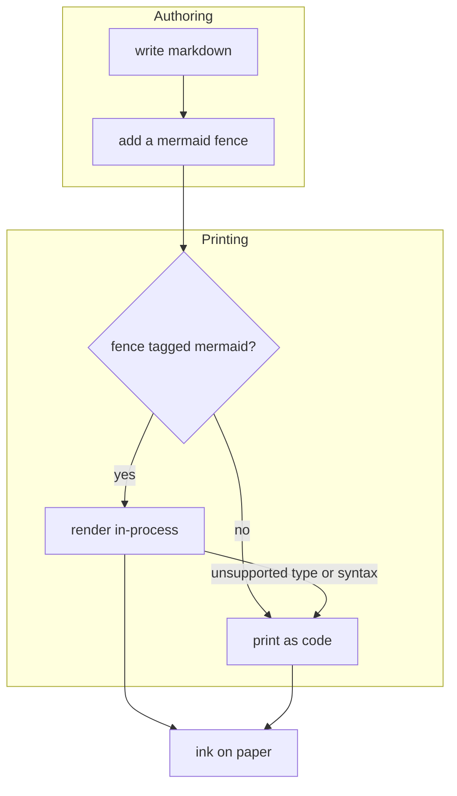
```mermaid
flowchart TB
    subgraph authoring[Authoring]
        MD[write markdown] --> FENCE[add a mermaid fence]
    end
    subgraph printing[Printing]
        PARSE{fence tagged mermaid?}
        PARSE -->|yes| RENDER[render in-process]
        PARSE -->|no| CODE[print as code]
        RENDER -->|unsupported type or syntax| CODE
    end
    FENCE --> PARSE
    RENDER --> PAGE[ink on paper]
    CODE --> PAGE
```

### Sequence, with alt, opt, and a note

Lifelines, solid and dashed arrows, alt + opt blocks, and a note.

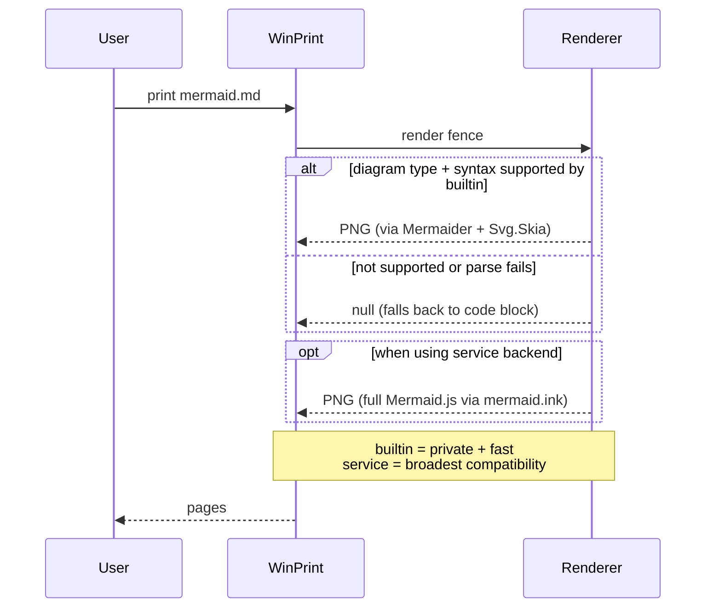
```mermaid
sequenceDiagram
    participant U as User
    participant W as WinPrint
    participant R as Renderer
    U->>W: print mermaid.md
    W->>R: render fence
    alt diagram type + syntax supported by builtin
        R-->>W: PNG (via Mermaider + Svg.Skia)
    else not supported or parse fails
        R-->>W: null (falls back to code block)
    end
    opt when using service backend
        R-->>W: PNG (full Mermaid.js via mermaid.ink)
    end
    Note over W,R: builtin = private + fast<br/>service = broadest compatibility
    W-->>U: pages
```

### State

Every printer I have ever owned:

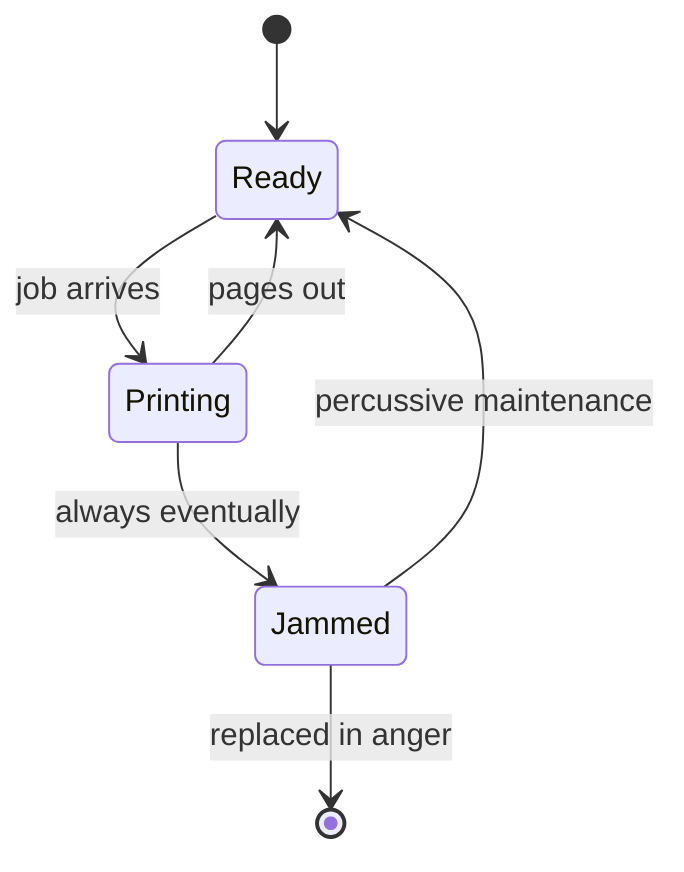
```mermaid
stateDiagram-v2
    [*] --> Ready
    Ready --> Printing: job arrives
    Printing --> Ready: pages out
    Printing --> Jammed: always eventually
    Jammed --> Ready: percussive maintenance
    Jammed --> [*]: replaced in anger
```

### Class

The inheritance hierarchy nobody asked to see printed, printed:

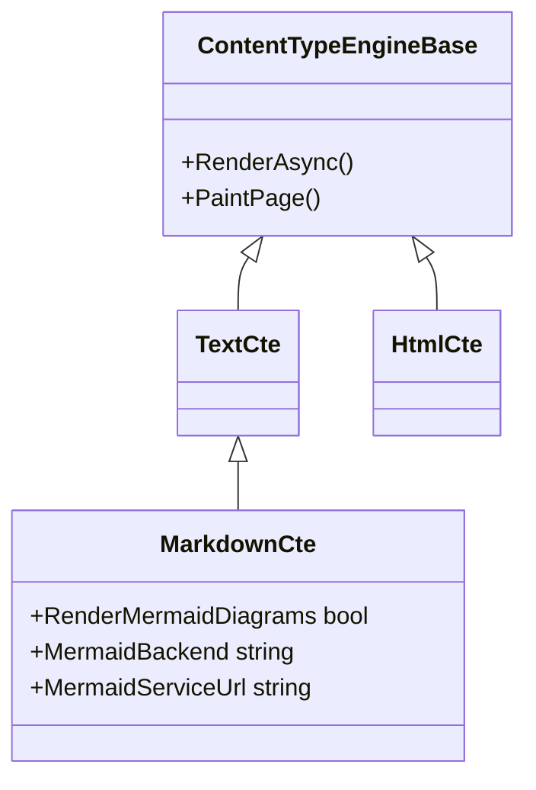
```mermaid
classDiagram
    ContentTypeEngineBase <|-- TextCte
    TextCte <|-- MarkdownCte
    ContentTypeEngineBase <|-- HtmlCte
    ContentTypeEngineBase : +RenderAsync()
    ContentTypeEngineBase : +PaintPage()
    MarkdownCte : +RenderMermaidDiagrams bool
    MarkdownCte : +MermaidBackend string
    MarkdownCte : +MermaidServiceUrl string
```

### Entity-relationship

A database for a printing app, which is to say, over-engineering:

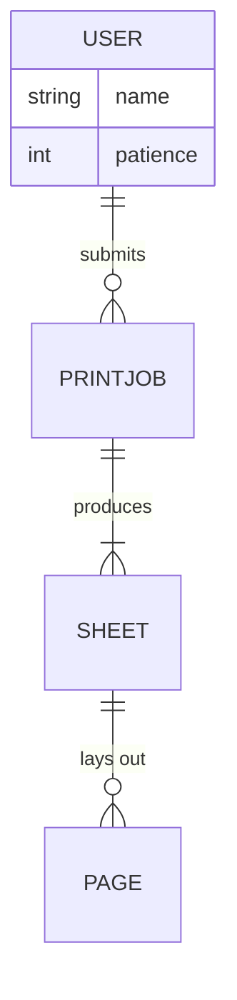
```mermaid
erDiagram
    USER ||--o{ PRINTJOB : submits
    PRINTJOB ||--|{ SHEET : produces
    SHEET ||--o{ PAGE : "lays out"
    USER {
        string name
        int patience
    }
```

### Git graph

Every release, ever:


```mermaid
gitGraph
    commit
    commit
    branch fix-the-fix
    commit
    checkout main
    merge fix-the-fix
    commit tag: "v3.x.x"
```

### Mindmap

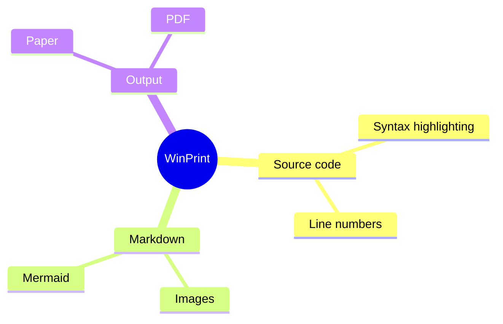
```mermaid
mindmap
  root((WinPrint))
    Source code
      Syntax highlighting
      Line numbers
    Markdown
      Images
      Mermaid
    Output
      Paper
      PDF
```

### Timeline

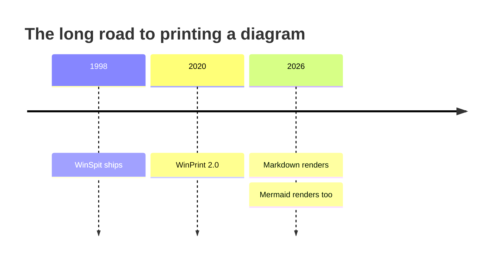
```mermaid
timeline
    title The long road to printing a diagram
    1998 : WinSpit ships
    2020 : WinPrint 2.0
    2026 : Markdown renders
         : Mermaid renders too
```

### Quadrant

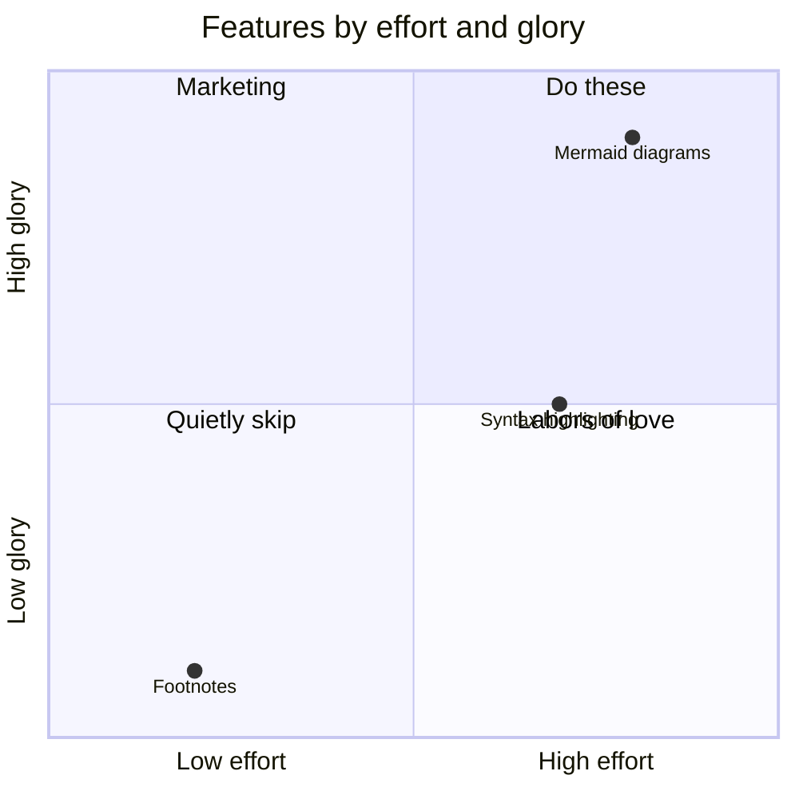
```mermaid
quadrantChart
    title Features by effort and glory
    x-axis Low effort --> High effort
    y-axis Low glory --> High glory
    quadrant-1 Do these
    quadrant-2 Marketing
    quadrant-3 Quietly skip
    quadrant-4 Labors of love
    Syntax highlighting: [0.7, 0.5]
    Mermaid diagrams: [0.8, 0.9]
    Footnotes: [0.2, 0.1]
```

### Pie (header on its own line)

The builtin renderer is particular about pie headers. Use this form for builtin.

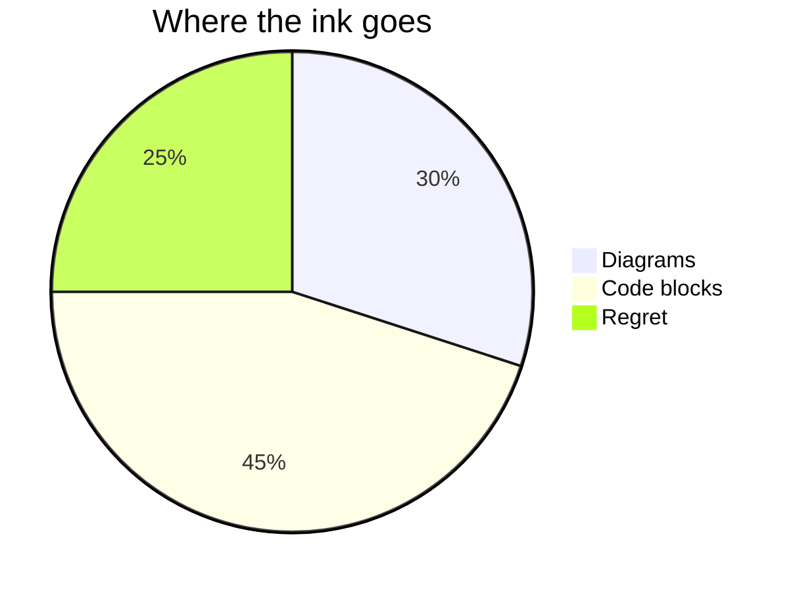
```mermaid
pie
    title Where the ink goes
    "Diagrams" : 30
    "Code blocks" : 45
    "Regret" : 25
```

### Radar (beta)

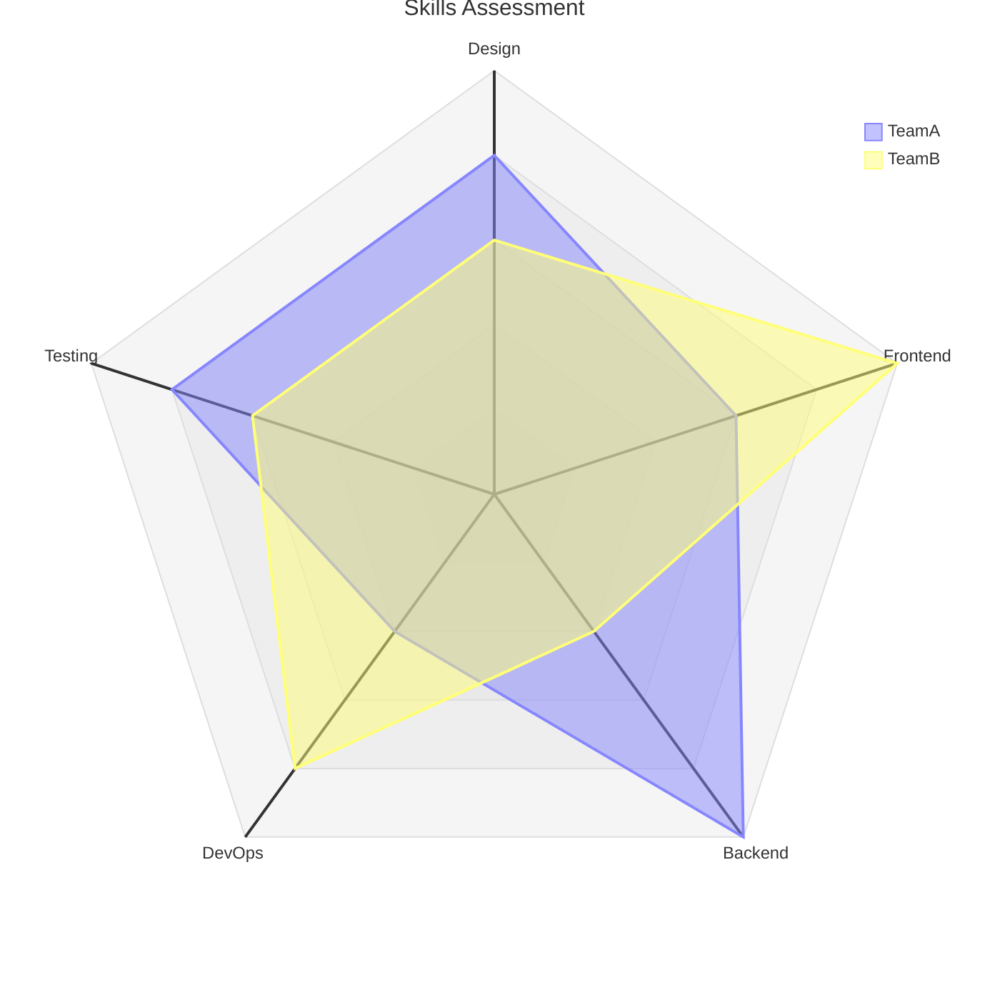
```mermaid
radar-beta
    title Skills Assessment
    axis Design, Frontend, Backend, DevOps, Testing
    curve TeamA{4, 3, 5, 2, 4}
    curve TeamB{3, 5, 2, 4, 3}
    max 5
    graticule polygon
```

### Treemap (beta)

```mermaid
treemap-beta
    "Core Rendering": 40
    "Mermaid Support": 15
    "TUI": 20
    "Maui GUI": 15
    "Docs + Tests": 10
```

### Venn (beta)

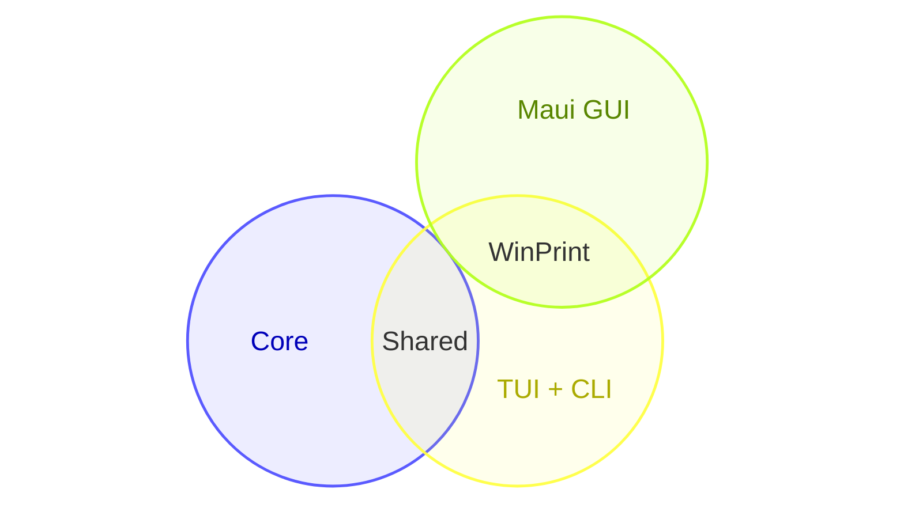
```mermaid
venn-beta
    set Core["Core"]
    set TUI["TUI + CLI"]
    set GUI["Maui GUI"]
    union Core,TUI["Shared"]
    union TUI,GUI["WinPrint"]
```

## Syntax stress cases (builtin limitations even on "supported" types)

These use valid Mermaid syntax that the service backend (and official mermaid.js) accepts, but that the current Mermaider detector + parsers reject. They prove that fallback works even for types the library claims to support.

### Pie with title on the same line as the keyword (very common form)

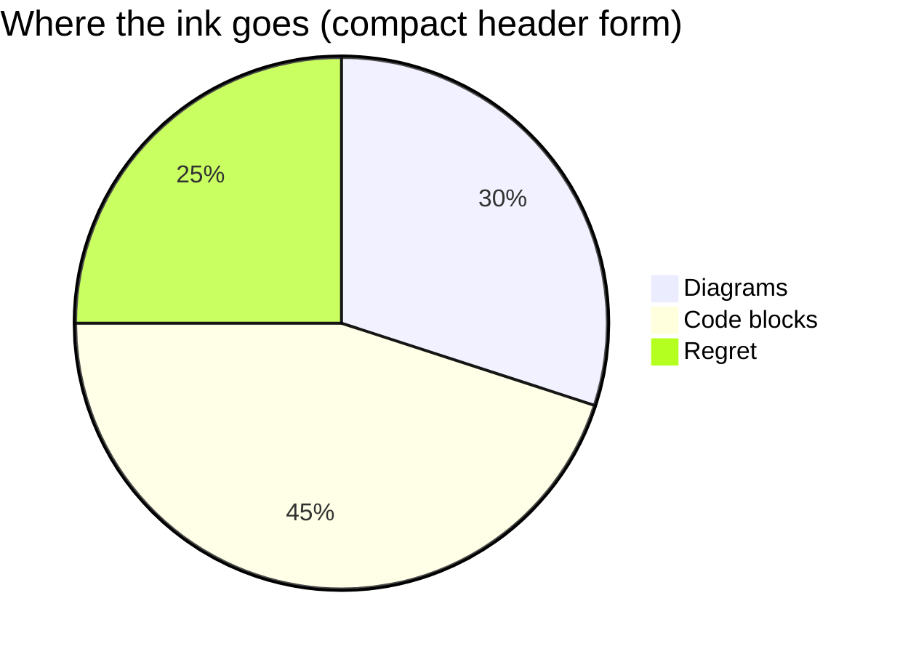
```mermaid
pie title Where the ink goes (compact header form)
    "Diagrams" : 30
    "Code blocks" : 45
    "Regret" : 25
```

### Quadrant with title on header line

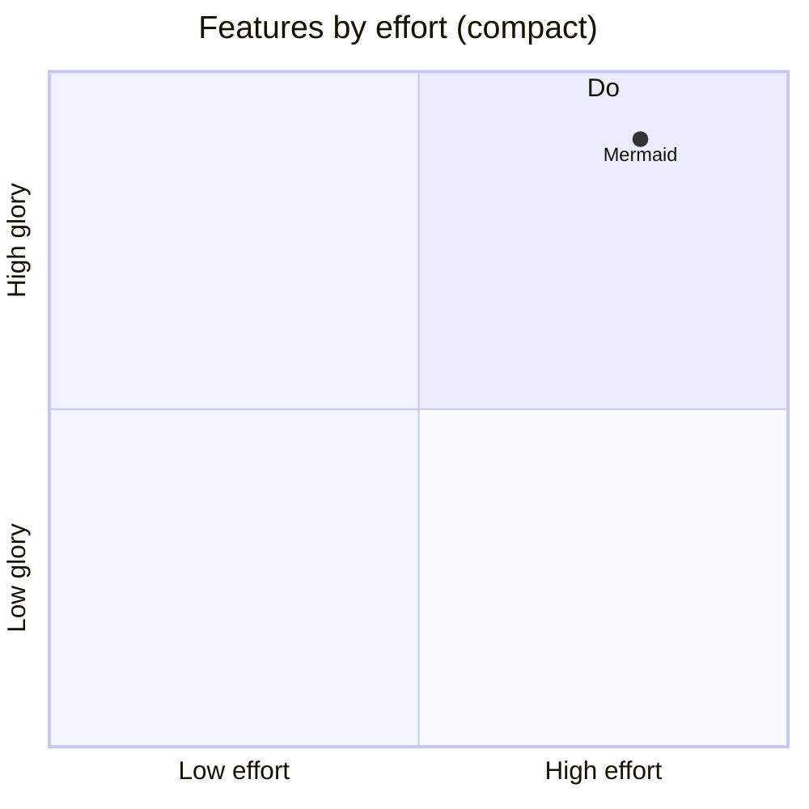
```mermaid
quadrantChart title Features by effort (compact)
    x-axis Low effort --> High effort
    y-axis Low glory --> High glory
    quadrant-1 Do
    Mermaid: [0.8, 0.9]
```

### Timeline with title on header line

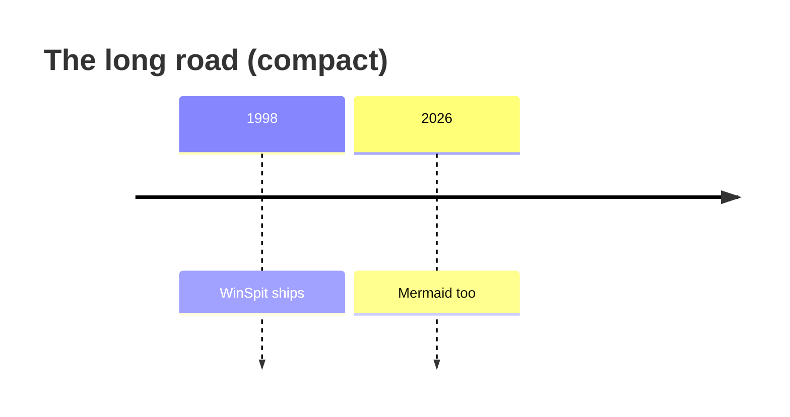
```mermaid
timeline title The long road (compact)
    1998 : WinSpit ships
    2026 : Mermaid too
```

## Unsupported diagram types + advanced features (fallback with builtin)

The following diagram types (or rich examples of them) are not implemented in Mermaider 0.8.0. With `mermaidBackend: "builtin"` they render as source code blocks. They are excellent for proving the fallback path and for comparing output between the two backends. (With the default service backend they should all render as images.)

### Gantt (classic unsupported)

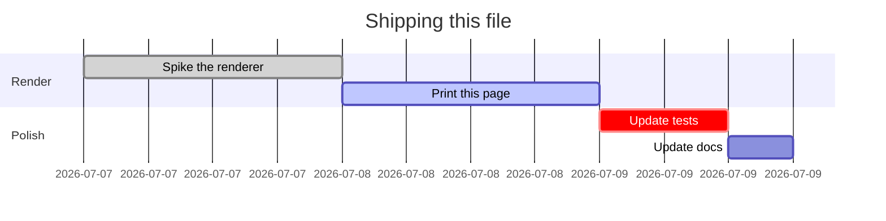
```mermaid
gantt
    title Shipping this file
    dateFormat  YYYY-MM-DD
    section Render
    Spike the renderer :done, a1, 2026-07-07, 1d
    Print this page    :active, a2, after a1, 1d
    section Polish
    Update tests       :crit, after a2, 12h
    Update docs        : 6h
```

### XY Chart

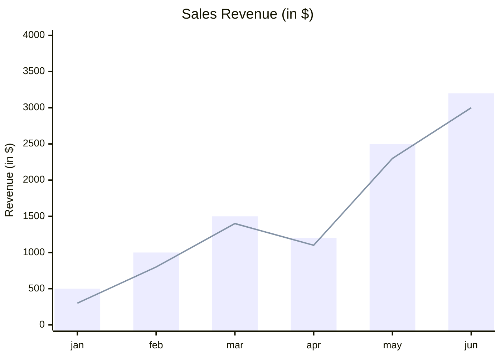
```mermaid
xychart-beta
    title "Sales Revenue (in $)"
    x-axis [jan, feb, mar, apr, may, jun]
    y-axis "Revenue (in $)" 0 --> 4000
    bar [500, 1000, 1500, 1200, 2500, 3200]
    line [300, 800, 1400, 1100, 2300, 3000]
```

### Sankey

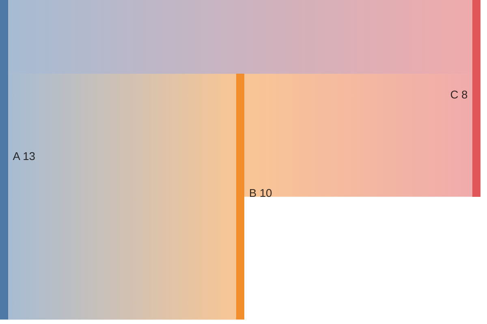
```mermaid
sankey-beta
    A, B, 10
    B, C, 5
    A, C, 3
```

### User Journey

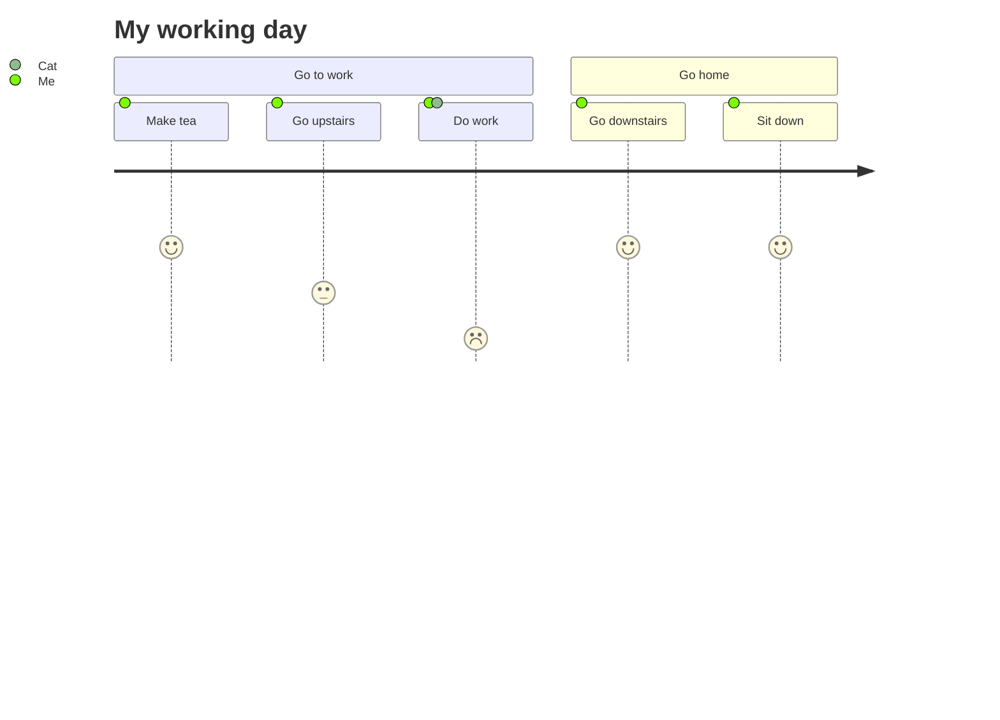
```mermaid
journey
    title My working day
    section Go to work
      Make tea: 5: Me
      Go upstairs: 3: Me
      Do work: 1: Me, Cat
    section Go home
      Go downstairs: 5: Me
      Sit down: 5: Me
```

### Requirement Diagram

```mermaid
requirementDiagram

requirement test_req {
id: 1
text: the test text.
risk: high
verifymethod: test
}

element test_entity {
type: simulation
}

test_entity - satisfies -> test_req
```

### C4 Context (simple)

```mermaid
C4Context
    title System Context diagram for Internet Banking System

    Person(customerA, "Banking Customer A", "A customer of the bank, with personal bank accounts.")
    System_Boundary(banking_system, "Internet Banking System") {
        Container(web_app, "Web Application", "Java, Spring MVC", "Delivers the static content and the Internet banking SPA")
    }

    Rel(customerA, web_app, "Uses")
```

### Kanban

```mermaid
kanban
  Todo
    Task1
    Task2
  In Progress
    Task3
  Done
    Task4
```

### Block Diagram

```mermaid
block-beta
columns 3
  A["A"] B["B"] C["C"]
  D["D"] E["E"] F["F"]
```

### Packet

```mermaid
packet-beta
0-15: "Header"
16-31: "Source"
32-47: "Destination"
```

### Architecture (beta)

```mermaid
architecture-beta
    group api(cloud)[API]

    service db(cloud)[Database]
    service disk(cloud)[Disk]

    api:B --> db:T
    api:B --> disk:T
```

---

**End of file.** The exact number of images you see depends on the active backend:

*   Default (see code): service backend → all fences that are valid Mermaid should produce images.
*   `mermaidBackend: "builtin"` → only the 13 types listed under "Supported by builtin", using compatible syntax.

The unit test `MermaiderRendererTests.MermaidShowcase_RendersSupportedTypes_FallsBackForTheRest` asserts 13 images when forcing the builtin path.

## Mermaid Backend Support Matrix

| Diagram Type          | Keyword(s)                          | Builtin (Mermaider 0.8.0)                          | Service (mermaid.ink / full Mermaid.js) | Notes / Caveats |
|-----------------------|-------------------------------------|----------------------------------------------------|-----------------------------------------|-----------------|
| Flowchart             | `flowchart` / `graph` (+ LR/TB/...) | Yes (incl. subgraphs, many shapes)                | Yes (full)                             | Best supported in builtin. |
| Sequence              | `sequenceDiagram`                   | Yes (alt, opt, notes, participants, etc.)         | Yes (full)                             | Good coverage. |
| State                 | `stateDiagram` / `stateDiagram-v2`  | Yes                                               | Yes                                    | — |
| Class                 | `classDiagram`                      | Yes                                               | Yes                                    | — |
| ER / Entity-Rel       | `erDiagram`                         | Yes                                               | Yes                                    | — |
| Git Graph             | `gitGraph`                          | Yes                                               | Yes                                    | — |
| Mindmap               | `mindmap`                           | Yes                                               | Yes                                    | — |
| Pie                   | `pie` (+ optional `showData`)       | Yes **only if header on own line** (`pie\n title ...`) | Yes (full, including `pie title Foo` on same line) | Major syntax caveat in builtin. Common form falls back. |
| Quadrant Chart        | `quadrantChart`                     | Yes **only if header on own line**                | Yes (full)                             | Same title-on-header limitation as pie. |
| Timeline              | `timeline`                          | Yes **only if header on own line**                | Yes                                    | Same limitation. |
| Radar                 | `radar` / `radar-beta`              | Yes                                               | Yes                                    | — |
| Treemap               | `treemap` / `treemap-beta`          | Yes                                               | Yes                                    | — |
| Venn                  | `venn` / `venn-beta`                | Yes                                               | Yes                                    | — |
| Gantt                 | `gantt`                             | No                                                | Yes                                    | Classic fallback example. |
| XY Chart              | `xychart` / `xychart-beta`          | No                                                | Yes                                    | — |
| Sankey                | `sankey` / `sankey-beta`            | No                                                | Yes                                    | — |
| User Journey          | `journey`                           | No                                                | Yes                                    | — |
| Requirement           | `requirementDiagram` / `requirement`| No                                                | Yes                                    | — |
| C4                    | `C4Context`, `C4Container`, ...     | No                                                | Yes                                    | — |
| Kanban                | `kanban`                            | No                                                | Yes                                    | — |
| Block                 | `block-beta`                        | No                                                | Yes                                    | — |
| Packet                | `packet-beta`                       | No                                                | Yes                                    | — |
| Architecture          | `architecture-beta`                 | No                                                | Yes (newer)                            | — |
| Others (Wardley, etc.)| various                             | No                                                | Yes (when Mermaid.js supports)         | — |

**Key takeaways:**
- Builtin currently implements the 13 types in Mermaider's `DiagramType` enum.
- Even for supported types there are syntax limitations (title placement for pie/quadrant/timeline).
- Service backend = (near) full fidelity to current Mermaid.js.
- WinPrint always falls back to a plain code block on any failure from either renderer. A typo in `mermaidBackend` safely falls back to builtin (never accidentally sends data).
- `mermaid.md` + its unit test act as the living spec, benchmark, and proof that fallback works.
