# Mermaid, the grand tour

`demo.md` shows one diagram and calls it a day. This file is the stress test: every diagram
type WinPrint's built-in renderer handles, drawn with enough going on to catch regressions,
plus the types it does not handle yet so the code-block fallback gets exercised too. If a
section below prints as source instead of a picture, that is either the fallback doing its
job or a bug; know which before filing it.

## Flowchart, with subgraphs

The classic. Direction, shapes, edge labels, and two subgraphs, because nobody's build
pipeline fits in one box.

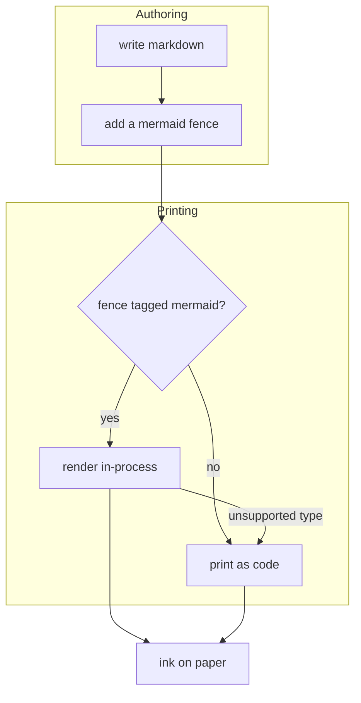

## Sequence, with alt and a note

Lifelines, solid and dashed arrows, an alt block, and a note. The full soap opera.

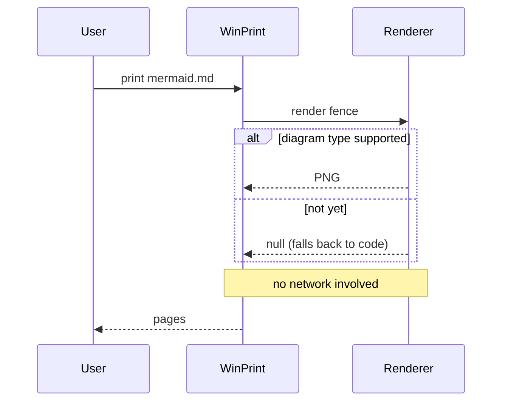

## State

Every printer I have ever owned:

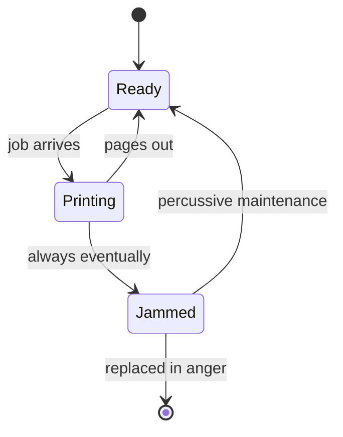

## Class

The inheritance hierarchy nobody asked to see printed, printed:

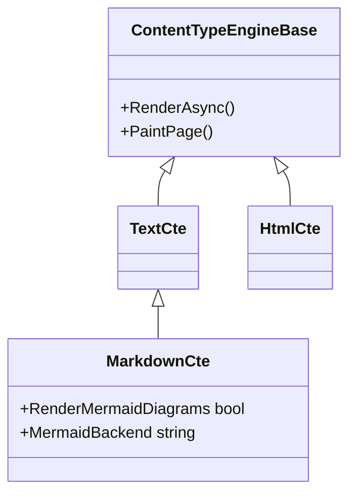

## Entity-relationship

A database for a printing app, which is to say, over-engineering:

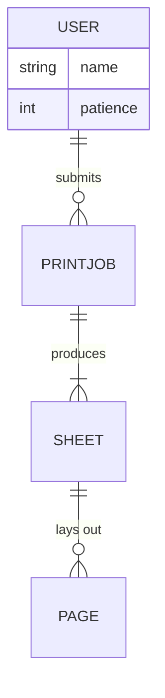

## Git graph

Every release, ever:

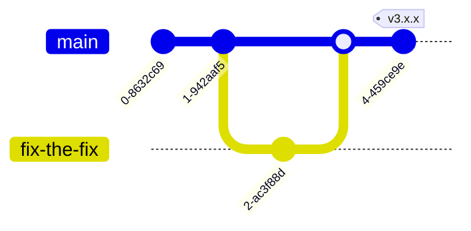

## Mindmap

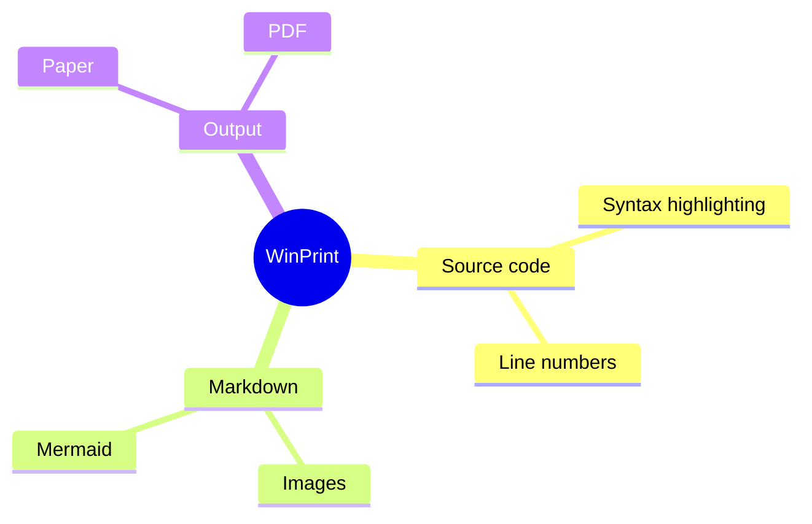

## Timeline

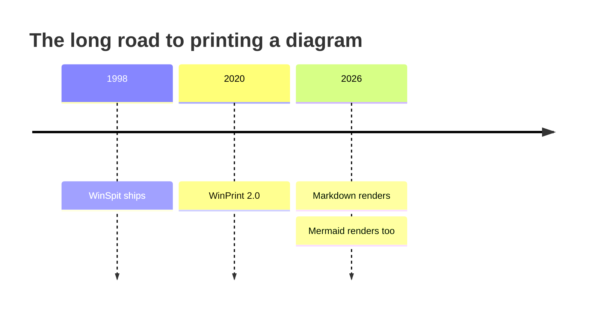

## Quadrant

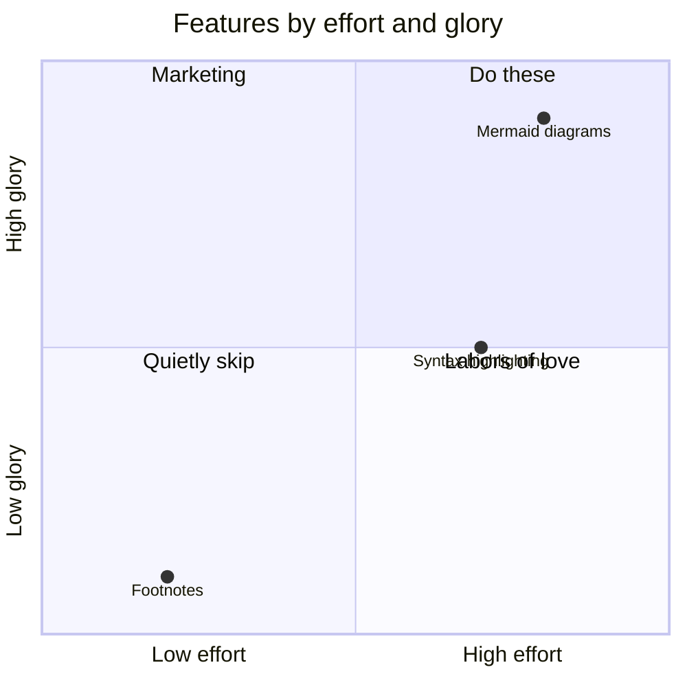

## Pie

Put `pie` on its own line; the renderer is particular about its headers.

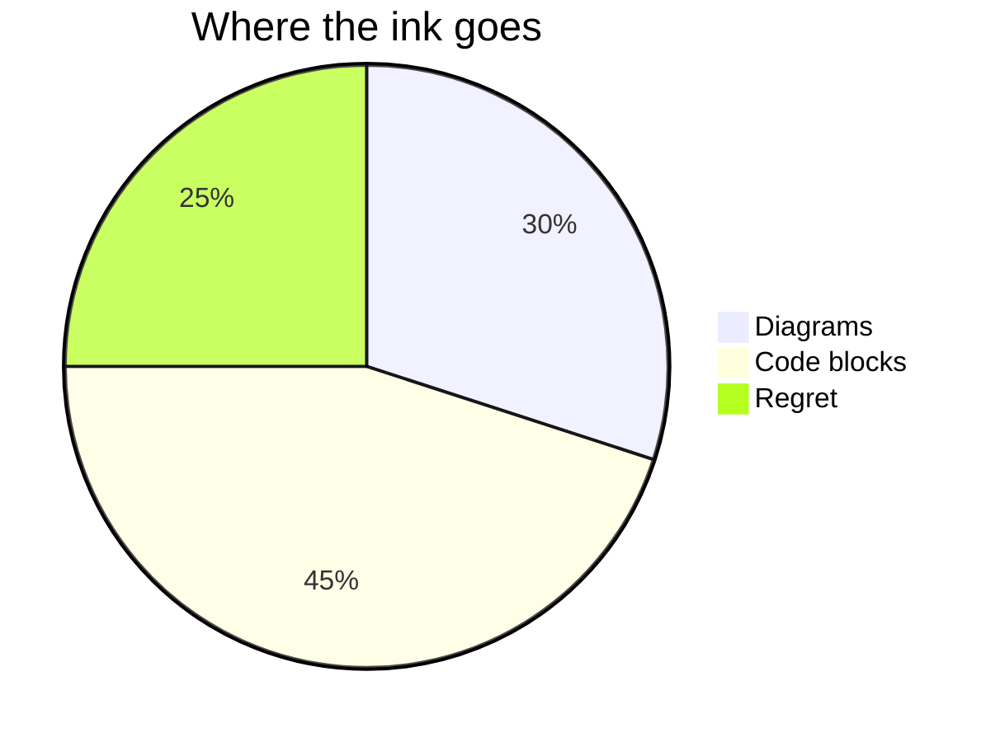

## Not yet: gantt

The built-in renderer does not do this one yet, so it prints as a code block below, exactly
as documented. Point `mermaidBackend` at `service` if you need it as a picture today.

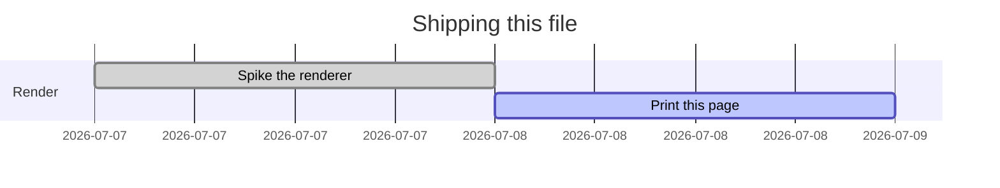
